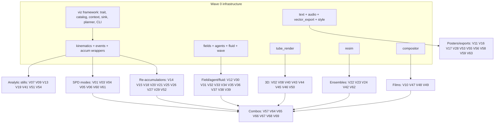

# Visualization Master Plan

This document is the single source of truth for the `viz` subsystem: sixty-nine
visualization modes that transform a finished three-body run (trajectory, palette,
and the 64-bin spectral power distribution buffer) into additional artworks. It
serves two purposes:

1. **Implementation spec.** Every mode has a detailed section in Part III:
   concept, output files, algorithm, constants, dependencies, determinism,
   performance budget, and a quality checklist. Shared infrastructure is
   specified in Parts I and II.
2. **Progress ledger.** The table below tracks implementation status. Update the
   ledger row and the `Status` line of the mode's spec section in the same
   commit that implements it.

Rules for maintaining this document:

- Status values: `[ ]` not started · `[~]` in progress · `[x]` implemented and
  verified against the quality checklist · `[e]` pre-existing feature absorbed
  into the viz framework.
- If an implementation deviates from the spec, edit the spec in the same PR so
  the document never lies.
- Mode ids (`V01`…`V69`) and CLI flag names are frozen. New ideas append
  new ids; never renumber.
- Every mode is seed-deterministic. Any randomness must come from
  `Sha3RandomByteStream::fork("viz/<flag>/v1")`. No exceptions.

---

## Status Ledger

Cost classes — **A**: < 1 min, reuses in-memory buffers · **B**: 1–5 min ·
**C**: 5–20 min, own sim/render loops · **D**: heavy, budget-capped by
`--viz-budget`.

| ID | Flag | Category | Primary artifacts | Cost | Depends on | Status |
|----|------|----------|-------------------|------|------------|--------|
| V01 | `alien-vision` | Spectral | 5 stills | A | SPD | `[ ]` |
| V02 | `hyperspectral-flythrough` | Spectral | video | C | SPD, tube_render | `[ ]` |
| V03 | `spectral-centroid` | Spectral | still | A | SPD | `[ ]` |
| V04 | `prism-portrait` | Spectral | still | A | SPD | `[ ]` |
| V05 | `spectrum-card` | Spectral | poster | A | SPD, text | `[ ]` |
| V06 | `thin-film` | Spectral | still | A | SPD | `[ ]` |
| V07 | `braid` | Physics | tall still + video | A | kinematics | `[x]` |
| V08 | `shape-sphere` | Physics | still + video | B | kinematics | `[ ]` |
| V09 | `gw-chirp` | Physics | WAV + poster | A | kinematics, audio, text | `[x]` |
| V10 | `sonification` | Physics | WAV + remuxed videos | B | kinematics, audio | `[ ]` |
| V11 | `recurrence` | Physics | still | B | kinematics | `[ ]` |
| V12 | `field-lines` | Physics | still + video | B | fields | `[ ]` |
| V13 | `syzygy-wheel` | Physics | still | A | events, text | `[x]` |
| V14 | `triangle-centers` | Physics | still + video | B | kinematics | `[ ]` |
| V15 | `medial-recursion` | Physics | still + video | B | — | `[ ]` |
| V16 | `chord-progression` | Physics | poster + video + WAV | B | kinematics, audio, text | `[ ]` |
| V17 | `epicycles` | Physics | video | B | rustfft | `[ ]` |
| V18 | `chrono-grid` | Time | poster | B | frame tap | `[ ]` |
| V19 | `slit-scan` | Time | 2 stills | A | frame tap | `[x]` |
| V20 | `strobe` | Time | still + video | B | accumulation | `[ ]` |
| V21 | `comet` | Time | video | C | accumulation | `[ ]` |
| V22 | `editorial-retime` | Time | video | C | events, accumulation | `[ ]` |
| V23 | `epilogue` | Time | video | C | resim | `[ ]` |
| V24 | `multiverse` | Time | poster + video | C | resim | `[ ]` |
| V25 | `three-shadows` | Frames | triptych | B | accumulation | `[ ]` |
| V26 | `corotating` | Frames | diptych + video | C | kinematics, accumulation | `[ ]` |
| V27 | `ride-along` | Frames | video | C | kinematics, accumulation | `[ ]` |
| V28 | `bullet-time` | Frames | video | C | events, orbit camera | `[ ]` |
| V29 | `retarded-time` | Frames | still + video | B | kinematics | `[ ]` |
| V30 | `lensing` | Frames | still + video | B | fields | `[ ]` |
| V31 | `dust-nebula` | Matter | video + still | C | fields, accumulation | `[ ]` |
| V32 | `light-echoes` | Matter | video | C | wave grid | `[ ]` |
| V33 | `physarum` | Matter | video + still | C | agents, energy field | `[ ]` |
| V34 | `frost` | Matter | video + still | C | agents, energy field | `[ ]` |
| V35 | `lightning` | Matter | still + video | C | events, agents | `[ ]` |
| V36 | `marbling` | Matter | video + still | C | fluid | `[ ]` |
| V37 | `roche` | Matter | video | C | fields | `[ ]` |
| V38 | `galaxy-collision` | Matter | video + still | C | resim-lite, accumulation | `[ ]` |
| V39 | `reconnection` | Matter | video | C | fields, events | `[ ]` |
| V40 | `aurora` | Matter | video | C | tube_render | `[ ]` |
| V41 | `winding-glass` | Topology | still | B | kinematics | `[x]` |
| V42 | `basin-map` | Topology | poster + data | D | resim | `[ ]` |
| V43 | `worldtube` | Topology | still + video | C | tube_render | `[ ]` |
| V44 | `neon` | 3D scene | still | C | tube_render | `[ ]` |
| V45 | `chandelier` | 3D scene | still + video | D | tube_render, energy field | `[ ]` |
| V46 | `turntable` | 3D scene | video | A | existing orbit.rs | `[x]` |
| V47 | `trailer` | Cinema | video | C | compositor, events | `[ ]` |
| V48 | `mission-control` | Cinema | video | C | text, kinematics, events | `[ ]` |
| V49 | `broadcast` | Cinema | video | D | compositor, V22 V26 V28 V23 V48 | `[ ]` |
| V50 | `sculpture-export` | Exports | STL + PLY + preview | B | vector_export, tube_render | `[ ]` |
| V51 | `plotter-svg` | Exports | SVG set | A | vector_export | `[x]` |
| V52 | `depth-pack` | Exports | 4 artifacts | B | depth accumulation | `[ ]` |
| V53 | `webgl-viewer` | Exports | JSON + HTML | B | vector_export | `[ ]` |
| V54 | `oscilloscope` | Exports | WAV + video | B | audio | `[x]` |
| V55 | `hologram` | Exports | huge still | D | rustfft | `[ ]` |
| V56 | `tilt` | Exports | print PNGs | B | frame tap, V52 | `[ ]` |
| V57 | `instrument` | Exports | HTML + JSON + WAV | C | V53, V54, V16 | `[ ]` |
| V58 | `ephemeris-poster` | Posters | poster | B | text, metadata | `[ ]` |
| V59 | `blueprint` | Posters | 2 stills | B | accumulation restyle | `[ ]` |
| V60 | `dwell-nebula` | Posters | still | B | density splat | `[ ]` |
| V61 | `topo-contours` | Posters | still | B | energy field | `[ ]` |
| V62 | `terra` | Posters | poster + video | C | V08, V42-lite, text | `[ ]` |
| V63 | `celestial-atlas` | Posters | poster | C | multi-seed input, text | `[ ]` |
| V64 | `powers-of-fate` | Combos | video | D | V42, compositor | `[ ]` |
| V65 | `witness` | Combos | video | D | V26, V27, V29, V30, V16, audio | `[ ]` |
| V66 | `rose-window` | Combos | video + still | D | V41, fields | `[ ]` |
| V67 | `vanitas` | Combos | long video | D | V33, V34, V35, V23, compositor | `[ ]` |
| V68 | `reliquary` | Combos | video | D | V43, V24, V09 | `[ ]` |
| V69 | `pond` | Combos | video | D | V32, V36, V09 | `[ ]` |

---

# Wave 0/1 Implementation Notes (2026-08-17)

Wave 0 (framework) and Wave 1 (eight modes) are implemented. Recorded
deviations from the original specs, to be resolved in later waves:

- **Viz manifest:** artifacts are recorded in `viz/manifest.json` instead of
  a `viz` section inside `metadata/assets.json` (keeps the production asset
  schema untouched until the website integrates viz outputs).
- **Typography:** `common/text.rs` (ab_glyph + bundled font) is deferred to
  the posters wave. Wave-1 artifacts ship text-free variants with JSON
  sidecars carrying the data that captions would have shown.
- **CLI shape:** modes are selected via `--viz <flag>` (repeatable, comma
  lists, categories, `all`) plus `--viz-list` and `--viz-quality`, rather
  than 69 separate boolean flags.
- **V07 braid:** the optional top-to-bottom reveal video is deferred; the
  braid word ships as `braid_word.txt` + `crossings.json`.
- **V19 slit-scan:** under `--image-only` the mode logs a warning and skips
  (no frame stream exists); the centroid column is the trajectory density
  centroid rather than an energy-weighted image centroid.
- **V41 winding-glass:** vertical span edges are exact per-scanline
  (horizontal edges antialiased analytically; no 2x supersample), and the
  color legend ships as `winding_histogram.json`.
- **V46 turntable:** implemented as an adapter over `render_orbit_video`
  with viz-standard paths; `--orbit-video` remains available and unchanged.
- **V51 plotter-svg:** embroidery variant and low-energy segment dropping
  deferred; stats sidecar included.
- **Frame tap:** implemented as an optional observer parameter on
  `app::render_video`, not a general fan-out registry (sufficient until
  more tap consumers exist).

# Part I — Subsystem Architecture

## I.1 Placement in the pipeline

The viz stage runs inside `main.rs`, in the non-`--image-only` branch, after
`app::render_video` returns and after the spectral gallery and sweep are
written — the only window where **both** the projected trajectory
(`positions`, `colors`, `body_alphas`, `levels`) and the accumulated SPD buffer
(`accum_spd: Vec<[f64; NUM_BINS]>`) are alive (`src/main.rs` ~488–519).

Required plumbing changes (small, listed once here, assumed by all specs):

1. `app::run_borda_selection_with_aesthetics` additionally returns the selected
   initial `Vec<Body>` (masses + initial state). Today masses are dropped after
   selection; several modes need them (energy series, resim, GW strain).
2. `app::render_still_image` gains the same SPD-return contract as
   `render_video`, so `--image-only --viz …` works. The tiled/striped still
   path never materializes a full SPD; when the pixel count exceeds
   `HIGH_RES_TILED_PIXEL_THRESHOLD`, SPD-requiring modes are skipped with a
   clear log line (documented per mode as "full-SPD only").
3. `pass_2_write_frames_spectral`'s `frame_sink` closure is wrapped by a
   fan-out (`FrameTap`) so frame-consuming modes observe every encoded video
   frame without re-rendering (see I.6).
4. A `viz` subdirectory is added to `setup_seed_directory`, and
   `write_asset_manifest` gains an optional `viz` section (entries appended by
   the `ArtifactSink`). `run.py`'s required-package check is deliberately NOT
   extended — production sync never depends on viz artifacts.
5. New orchestration entry point: `app::run_viz_stage(&VizStageInputs) ->
   Result<VizStageReport>` keeps `main.rs` thin.

## I.2 Module tree

```text
src/viz/
  mod.rs              VizMode trait, VizError, dispatcher, stage report
  catalog.rs          static catalog of all modes (id, flag, category,
                      artifacts, cost class, requirement flags, deps)
  context.rs          VizContext: borrowed run data + lazy derived data
  sink.rs             ArtifactSink: file writing, manifest entries, logging
  planner.rs          resource planner: requirement union, stage ordering,
                      peak-memory sequencing
  common/
    kinematics.rs     velocities, accelerations, pairwise distances, energy,
                      angular momentum, curvature series
    events.rs         periapses, syzygies, closest triple approach, drama curve
    resim.rs          deterministic re-simulation: perturbation ensembles,
                      extended runs, basin scans
    fields.rs         potential/force grids, equipotentials (marching squares),
                      evenly-spaced streamlines (Jobard–Lefer)
    agents.rs         deterministic agent framework (Physarum, DLA, walkers)
    fluid.rs          2D stable-fluids solver (advection, projection, dye)
    wave.rs           2D scalar wave-equation grid (light echoes, cymatics)
    tube_render.rs    sphere-traced SDF renderer for trajectory tubes and
                      volumetric scenes -> PixelBuffer
    accum.rs          pub(crate) wrappers over render internals: custom-schedule
                      spectral accumulation, decay accumulation, depth channel
    text.rs           glyph rasterization (ab_glyph) + layout onto PixelBuffer
    audio.rs          WAV writer (48 kHz PCM), synthesis helpers, FFmpeg muxing
    vector_export.rs  SVG paths, binary STL, ASCII PLY writers
    compositor.rs     multi-segment film assembly (FFmpeg concat/xfade), title
                      cards, audio track assembly
    style.rs          shared poster/typography design system
  modes/
    spectral/         V01–V06     physics/   V07–V17    time/     V18–V24
    frames/           V25–V30     matter/    V31–V40    topology/ V41–V43
    scene3d/          V44–V46     cinema/    V47–V49    exports/  V50–V57
    posters/          V58–V63     combos/    V64–V69
```

One file per mode. Every public item documented (crate denies `missing_docs`);
rustfmt 100 cols; clippy clean with `-D warnings`.

## I.3 Core trait and context

```rust
/// A single visualization mode, executed after the main render.
pub trait VizMode: Sync {
    /// Stable identifier; equals the CLI flag name.
    fn id(&self) -> &'static str;
    /// Resources this mode needs the planner to prepare or retain.
    fn requirements(&self) -> Requirements;
    /// Render all artifacts into the sink. Must be deterministic per seed.
    fn run(&self, ctx: &VizContext<'_>, sink: &mut ArtifactSink) -> Result<(), VizError>;
}

bitflags Requirements {
    KINEMATICS, EVENTS, SPD, BIN_BUFFERS, ENERGY_FIELD, FRAME_TAP,
    RESIM, EXTENDED_SIM, DEPTH_CHANNEL, AUDIO_MUX, MULTI_SEED_INPUT
}
```

`VizContext` borrows what the pipeline already has and lazily computes shared
derivations exactly once (`OnceCell`), so twelve selected modes never compute
the same velocity series twice:

- Borrowed: `positions: &[Vec<Vector3<f64>>; 3]`, `colors`, `body_alphas`,
  initial `bodies: &[Body; 3]` (masses), `levels: &ChannelLevels`,
  `render_ctx: &RenderContext`, `spectral_settings`, `accum_spd: Option<&[[f64; 64]]>`,
  seed bytes, resolved visual profile (palette metadata, scene traits).
- Lazy (computed on first request): `Kinematics`, `Events`, `BinBuffers`,
  `EnergyField` (per-pixel total SPD energy as `Vec<f32>`), decimated
  polylines (RDP-simplified per body at several tolerances).
- Factories: `rng(mode_flag) -> Sha3RandomByteStream` forking
  `viz/<flag>/v1`; `quality() -> VizQuality`; `budget() -> VizBudget`.

`ArtifactSink` owns `output/<name>/viz/<flag>/`, provides
`write_png16`, `write_video(web+hq via existing encoder profiles)`,
`write_wav`, `write_text_file`, `write_bytes`, records every artifact
(path, kind, dimensions, bytes) for the manifest, and tags logs with the mode id.

## I.4 CLI

```text
--viz <flags>       repeatable, comma-separated mode flags; accepts category
                    names (e.g. --viz spectral) and "all"
--viz-list          print the catalog table (id, flag, category, cost, status
                    of required inputs) and exit
--viz-quality       draft | final   (default: final; draft halves linear
                    resolution, quarters frame counts and agent/particle
                    counts — development aid only)
--viz-budget <s>    wall-clock budget in seconds for each D-class mode
                    (default 900); D-modes downscale their grids/ensembles
                    deterministically from the budget, never from timers
--viz-seeds-dir <p> input directory of prior seed packages (V63 only)
```

Flag validation is strict: unknown mode names abort before simulation starts.
The catalog powers `--viz-list`, flag parsing, and this ledger's consistency
test (a unit test asserts catalog ids == ledger ids in this file).

Budget note: "budget" never introduces nondeterminism. Each D-mode maps the
budget to concrete deterministic parameters (grid size, sample counts) via
fixed lookup curves; two machines with the same budget produce identical
artifacts regardless of actual speed.

## I.5 Determinism

- One RNG fork per mode: `viz/<flag>/v1`, versioned exactly like
  `cosmic-structure/v2` — behavioral changes bump the domain suffix.
- Agent sims hash `(mode domain, agent index, step)` into per-agent streams so
  rayon scheduling cannot affect results.
- All parallel reductions use ordered joins (rayon `map` + sequential merge,
  as the existing step-chunking accumulator already does), never atomics with
  racy ordering.
- FFmpeg invocations pass explicit `-r`, `-pix_fmt`, color metadata, and
  never depend on wall-clock (`-metadata` timestamps omitted or fixed).

## I.6 Resource planner and peak memory

The planner unions the requirements of all selected modes and schedules four
phases:

1. **Tap phase** (during the main render): if any mode requires `FRAME_TAP`,
   the pass-2 frame sink fans out each `rgb48le` frame to registered
   subscribers (V18, V19, V56). Subscribers must be O(frame) and allocation-free
   per frame; they own small accumulators (a column strip, N checkpoint
   snapshots), never full frame history.
2. **SPD phase** (immediately after gallery/sweep, SPD alive): V01–V06, V60,
   V61, energy-field construction, and `BinBuffers` if required. Peak-memory
   rule: at the default 3456×2234, SPD ≈ 3.7 GiB and `BinBuffers` ≈ 5.5 GiB —
   the same peak the existing gallery already reaches; the planner builds
   `BinBuffers` once, runs all consumers, then drops it before phase 3.
3. **Trajectory phase** (SPD dropped unless a mode still holds a slice): all
   kinematics/field/agent/fluid/3D modes, re-accumulations, resims. Modes
   declaring `SPD` + phase-3 behavior (e.g. V45 needs the energy field only)
   receive the compact `EnergyField` (`Vec<f32>`, ~30 MiB) instead of the SPD.
4. **Assembly phase**: compositor films (V47, V49, V64, V67), which consume
   artifacts produced in earlier phases, then manifest write.

Within a phase, modes run sequentially in catalog order (deterministic logs,
bounded memory); each mode parallelizes internally with rayon.

## I.7 Failure policy

A failing mode logs `viz mode <flag> failed: <error>`, is recorded as failed in
the stage report and the manifest, and does not abort other modes. The process
exit code is nonzero if any explicitly requested mode failed. The core package
(images/videos/spectral/metadata) is never at risk: viz runs strictly after it.

## I.8 New dependencies and assets

- `ab_glyph` (font rasterization) — the only new crate. WAV, STL, PLY, and SVG
  writers are hand-rolled in `common/` (each format is < 100 lines).
- `assets/fonts/`: one OFL-licensed family embedded via `include_bytes!`
  (regular + bold + mono weights; IBM Plex is the working choice — its OFL
  license passes `deny.toml`, and the mono cut suits telemetry/almanac looks).
- `assets/viewer/`: static HTML/JS templates for V53/V57 (no build step, no
  external CDN; single-file, ES modules inline).

## I.9 Testing and CI

- Unit tests per common module (math: winding numbers on synthetic loops,
  marching squares on analytic fields, WAV header bytes, STL triangle counts).
- Golden tests: each deterministic still mode renders at 512×288 with a fixed
  seed in `cargo test --release -- --ignored viz_golden`; SHA256 recorded in
  `ci/viz_golden.json` (same philosophy as `ci/verify_reference.py`).
- `--viz-list` snapshot test asserts catalog/ledger consistency.
- CI job addition: build with viz, run golden subset (A/B-cost modes only;
  C/D modes are smoke-run at 160×100 draft quality without hash pinning where
  they depend on float-order-sensitive sims).

---

# Part II — Shared Infrastructure

Each module below is specified once; mode specs in Part III reference these
APIs instead of restating them. All buffers are `PixelBuffer`
(`Vec<(f64, f64, f64, f64)>`, premultiplied linear RGBA) unless stated, so the
existing tonemap → quantize → `save_image_as_png_16bit` / video encoder chain
finishes every mode identically (Display P3 metadata everywhere).

## II.1 `common/kinematics.rs`

```rust
pub struct Kinematics {
    pub velocities: [Vec<Vector3<f64>>; 3],   // central differences, dt = DEFAULT_DT
    pub speeds:     [Vec<f64>; 3],
    pub accelerations: [Vec<Vector3<f64>>; 3],
    pub pairwise:   [Vec<f64>; 3],            // r12, r13, r23 per step
    pub kinetic:    Vec<f64>, pub potential: Vec<f64>,  // needs masses
    pub angular_momentum: Vec<Vector3<f64>>,
    pub curvature:  [Vec<f64>; 3],            // |v × a| / |v|^3
}
```

Endpoints use one-sided differences. Computed once, O(steps), ~200 MB for 1M
steps — planner drops it after the last consumer. A `stride(n)` view yields
decimated series for modes that need only ~10⁴ samples.

## II.2 `common/events.rs`

- `periapses(pair) -> Vec<Approach { step, distance, speed }>` — local minima
  of `pairwise` below the 10th percentile, non-maximum-suppressed within
  ±2,500 steps.
- `closest_triple() -> usize` — argmin of `r12 + r13 + r23`.
- `syzygies() -> Vec<Syzygy { step, middle_body, sharpness }>` — zero
  crossings of the signed triangle area with collinearity sharpness
  `4·area / perimeter²` below 0.02; `middle_body` = the body between the
  others on the line.
- `drama() -> Vec<f64>` — normalized blend
  `0.5·(r_min_inv / p99) + 0.3·|dKE/dt|_norm + 0.2·syzygy_proximity`,
  Gaussian-smoothed (σ = 1,200 steps). Drives V22, V47, V49.

## II.3 `common/resim.rs`

Deterministic re-simulation on top of the existing integrator
(`sim::get_positions`):

- `rerun(bodies, steps)` — exact replay (identical float path: same code, same
  order).
- `extended(bodies, factor)` — replay with `steps × factor`; the tail beyond
  the original window is the "epilogue" segment. Ejection detection reuses
  `is_definitely_escaping` sampled every 10,000 steps.
- `perturb_grid(bodies, axis_u, axis_v, n, epsilon)` — n×n lattice of initial
  conditions displaced in a fixed 2-plane of phase space (body 1 position x/y
  by default); returns outcome records (survivor id, ejection step, final
  energy) from short capped runs. Rayon-parallel; each cell independent.
- `perturb_ensemble(bodies, count, epsilon, rng)` — isotropic random
  perturbations for V24/V68.

## II.4 `common/fields.rs`

- `PotentialGrid::sample(bodies_at_step, w, h, render_ctx, softening)` —
  Φ(x,y) = −Σ mᵢ/√(d² + s²) on a pixel-aligned grid (s = 2 px in world units).
- `equipotentials(grid, levels) -> Vec<Polyline>` — marching squares with
  linear interpolation; levels spaced in `asinh(Φ)` for even visual density.
- `streamlines(grid, spacing) -> Vec<Polyline>` — Jobard–Lefer evenly-spaced
  streamlines of −∇Φ, RK2 integration, half-spacing termination.
- `RocheGrid` — same, in the co-rotating frame of a chosen pair with the
  centrifugal term `−½ω²ρ²`; exposes the L1 saddle value for V37.

## II.5 `common/agents.rs`

Framework: `struct Swarm<A: Agent> { step(field): all agents sense → act →
deposit }` with per-agent RNG = SHA3(domain ‖ agent_idx ‖ step) — order-free
determinism. Provided agents:

- `PhysarumAgent` — classic sense-ahead trio (angle ±22.5°, distance 9 px at
  default res), rotate toward strongest, move 1 px, deposit; trail grid gets
  3×3 diffusion + 0.92 decay per tick.
- `DlaWalker` — spatial-hash random walk, sticks on 8-neighborhood contact,
  birth/kill radii follow cluster bounding box.
- `StreamerTip` — dielectric-breakdown tip for V35: candidate growth sites
  weighted by (local potential)^η, η = 2.

## II.6 `common/fluid.rs`

Stam stable fluids on a staggered grid (default 1728×1117 = half res, upsampled
bicubically at composite): semi-Lagrangian advection, 48 Jacobi pressure
iterations, vorticity confinement ε = 2.0. Dye = 3 independent RGB fields in
linear light. Forces: each body is a moving Gaussian stirrer (radius 14 px,
strength ∝ speed), plus optional divergence sources at periapses. Fixed
timestep = 1/60 s of video time; deterministic.

## II.7 `common/wave.rs`

2D scalar wave equation `u_tt = c²∇²u − γ u_t` (leapfrog, CFL 0.45, absorbing
sponge boundary 48 px). Sources: per-body oscillators with amplitude ∝ speed
and frequency locked to the body's palette hue (violet bodies ring higher).
Output taps: instantaneous field, energy envelope (for long-exposure
integration). Used by V32, V69; V66 uses the envelope as caustic driver.

## II.8 `common/tube_render.rs`

CPU sphere-tracer for trajectory geometry, rayon tile-parallel:

- Scene = capsule chains (decimated polylines, radius profile per mode) +
  optional ground plane / room box; acceleration via uniform grid over
  segments (cell = 2× max radius).
- Materials: emissive (body palette, HDR intensity), dielectric glass
  (Schlick), matte wall.
- Volumetrics: single-scatter fog with equiangular sampling toward the K
  brightest emitters (K = 24), for V45/V40.
- Camera: orbit rig (reuses `orbit.rs` conventions: yaw/tilt around
  view-invariant bounds) + dolly paths defined by cubic splines.
- Output: `PixelBuffer` in linear Rec.2020 → existing tonemap chain. Draft
  quality: half res, 1 spp; final: full res, 4 spp + blue-noise jitter,
  fixed sample seeds.

## II.9 `common/accum.rs`

`pub(crate)` wrappers over `render/mod.rs` internals (exposing, not forking,
the production code paths):

- `accumulate_range(scene, spd, step_range)` — the existing incremental
  accumulator with an arbitrary step schedule.
- `accumulate_with_decay(scene, spd, window, half_life)` — comet mode: before
  each frame's new steps, scale the whole SPD by `2^(−Δsteps/half_life)`
  (SIMD multiply; the buffer stays premultiplied-energy-linear).
- `accumulate_transformed(scene', spd)` — same accumulator on a transformed
  copy of positions (frames category); transforms are pure functions
  `[Vec<Vector3>;3] -> [Vec<Vector3>;3]` defined per mode.
- `DepthChannel` — optional parallel W×H `f32` buffer recording
  energy-weighted mean z during accumulation (V52's depth map source).

## II.10 `common/text.rs`

`ab_glyph`-based rasterizer: `draw_text(buf, &Font, Style { px, weight,
tracking, align, color }, x, y, &str)`; tabular numerals for data columns;
`measure()` for layout. All poster text is drawn in linear light with 4×
supersampled coverage (crisp at 16-bit). No shaping engine (Latin + digits +
basic punctuation only — sufficient for all posters; a unit test asserts the
glyph set covers every string the posters emit).

## II.11 `common/audio.rs`

- `WavWriter` — 48 kHz, 24-bit PCM, stereo; header hand-rolled (~40 lines).
- Synthesis helpers: band-limited sine/saw oscillator bank, ADSR, soft-clip
  `tanh` limiter, equal-power pan, `resample_series(series, len)` for mapping
  step-domain data to sample domain.
- `mux(video, wav, out)` — FFmpeg `-c:v copy -c:a aac -b:a 192k`; used by V10,
  V49, V54, V64, V65, V68.

## II.12 `common/vector_export.rs`

- SVG: polyline/path emitter with RDP simplification (tolerance in px),
  layers as `<g>` with ids, stroke width/opacity attributes; header includes
  physical size (mm) for plotters.
- STL (binary): tube mesh triangulator (n-gon sweep along polyline with
  parallel-transport frames, end caps); watertightness unit-tested via Euler
  characteristic.
- PLY (ASCII): xyz + rgb + intensity point clouds.

## II.13 `common/compositor.rs`

Films are assembled from **segments** (each a finished mp4 or a frame
generator) plus an audio plan:

- `Segment { source, in/out trim, label }`, `Transition { Cut | Xfade(frames) }`.
- Title cards rendered via `text.rs` into stills, held N frames.
- Assembly: single FFmpeg `filter_complex` graph (`xfade`, `concat`, `amix`,
  `adelay`) producing web + HQ variants with the existing encoder profiles.
- Determinism: filter graph string is a pure function of inputs.

## II.14 `common/style.rs`

The shared design language that makes 69 artifacts feel like one collection:

- Layout: margins = 1/24 of short edge; 12-column grid; captions in the
  bottom margin, small caps, tracking +8%.
- Type scale: modular 1.333 from a 16 px base at 2234-short-edge (scales with
  resolution).
- Palettes: poster ink colors are derived from the seed's palette genome
  (dominant body hue at L = 0.82 for accents) over three paper stocks:
  `deep-black` (existing negative space), `cyanotype` (OKLCh L 0.28 C 0.07
  H 250), `archival-cream` (L 0.94 C 0.02 H 95).
- Every poster carries a footer line: seed hex, mode id, resolution, and the
  crate version — typeset, never burned pixel junk.

---

# Part III — Mode Specifications

Template per mode: **Concept & masterpiece bar** (the artistic intent and what
"done" means aesthetically) · **Artifacts** (exact paths under
`output/<name>/viz/<flag>/`) · **Algorithm** · **Constants** · **Uses**
(context data + common modules) · **RNG** · **Performance** · **Quality
checklist** · **Status**.

All stills are 16-bit Display P3 PNGs via the existing quantizer; all videos
are dual web/HQ encodes via the existing profiles unless stated.

---

## Category: Spectral (V01–V06)

### V01 `alien-vision` — The Same Light, Other Eyes

Cost A · Deps: SPD.

**Concept & masterpiece bar.** Re-render the identical physical light field
through five non-human observers. Not palette swaps — new color matching
functions integrated against the true per-pixel SPD, so metamers split and
hidden structure surfaces. Masterpiece bar: each variant must be internally
coherent (own white point, own gamut mapping), gallery-hangable alone, and
visibly *revealing* (regions that look identical in the master render must
differentiate).

**Artifacts.** `bee.png`, `dog.png`, `mantis.png`, `night.png`, `thermal.png`
(full resolution), plus `strip.png` (all five + master, captioned via
`style.rs`).

**Algorithm.**
1. Build five 64-entry sensitivity LUTs (replacing `BIN_XYZ_LUT`):
   - **bee** — trichromat (UV 350 nm approximated by extrapolated 380–420 nm
     weight boost, blue 440, green 540), mapped UV→blue, blue→green,
     green→red.
   - **dog** — dichromat (S 429 nm, L 555 nm) rendered through a projection
     onto the dichromat confusion-line gamut (Brettel-style), then to P3.
   - **mantis** — 12 narrow Gaussians (σ 12 nm) mapped to a 12-stop
     categorical OKLCh hue wheel: posterized, stained-glass-like false color.
   - **night** — scotopic V′(λ) (peak 507 nm) as luminance; chroma from a
     fixed moonlit OKLCh ramp (C ≤ 0.04); Purkinje shift emerges naturally.
   - **thermal** — bin index treated as pseudo-temperature; total energy →
     inferno-style OKLCh ramp built from the seed's palette genome anchor.
2. For each variant, per pixel: integrate `local_spd` against the LUT with
   the same per-bin soft-saturation tone mapping as production (`1−exp(−k·e)`
   with variant-specific k tables), then variant white-balance
   (flat-SPD → variant white), OKLab vibrance, `preserve_hue_gamut_map`.
3. Reuse the run's frozen `ChannelLevels` so exposure matches the master
   render; quantize.

**Constants.** Receptor peaks/σ as above; mantis stops = 12; night chroma cap
0.04.

**Uses.** `accum_spd`, `spectrum.rs` LUT machinery, `oklab.rs`, `style.rs`
(strip captions).

**RNG.** None (fully deterministic from SPD; thermal ramp reads palette
genome).

**Performance.** 5 × O(W·H·64) integrations ≈ the cost of five SPD→RGBA
passes (SIMD path reusable); < 30 s total at default res. Runs in SPD phase.

**Quality checklist.**
- [ ] Metamer split visible on at least the golden-seed set (two regions equal
      in master, different in ≥ 2 variants).
- [ ] No gamut clipping artifacts (hue-preserving mapping verified on
      saturated cores).
- [ ] Strip typography passes `style.rs` review.

**Status:** `[ ]`

---

### V02 `hyperspectral-flythrough` — Flying Through the Spectrum

Cost C · Deps: SPD, BinBuffers, tube_render camera rig.

**Concept & masterpiece bar.** Treat the SPD as a translucent volume
(x, y, λ) and fly a camera through it: wavelength becomes *depth*. The sweep
video slices this volume; the flythrough reveals it as a glowing nebula whose
strata are colors. Masterpiece bar: continuous parallax that makes the
spectral structure legible as 3D — violet foothills, red canyons — with no
voxel shimmer.

**Artifacts.** `flythrough.mp4` (24 s, 60 fps, web+HQ).

**Algorithm.**
1. Volume = `BinBuffers` (64 slabs of W×H RGB) stacked with slab spacing
   `Δz = min(W,H)/96`; trilinear sampling; per-slab emissive color =
   `wavelength_to_rgb(bin)` × stored energy.
2. Camera path: cubic spline from wide violet-side three-quarter view,
   diving parallel to the λ axis with slow barrel roll (≤ 20°), emerging at
   the red face; easing = smoothstep; 1440 frames.
3. Ray-march with fixed step `Δz/2`, front-to-back alpha compositing,
   transmittance floor 1e-3 early-out; energy→alpha via
   `1−exp(−σ·e)`, σ tuned so mean transmittance at mid-volume ≈ 0.35.
4. Tonemap with the run's levels; encode.

**Constants.** 64 slabs; 1440 frames; σ calibration target 0.35; roll ≤ 20°.

**Uses.** `BinBuffers`, `tube_render` camera rig (marcher is mode-local),
existing encoders.

**RNG.** `viz/hyperspectral-flythrough/v1` — blue-noise ray jitter only.

**Performance.** ~7.7M rays × ~192 steps per frame is too hot at full res:
render at 1728×1118 with 2× temporal supersample, upscale bicubic (this is a
volumetric mood piece; verified acceptable in draft studies). Runs in SPD
phase (needs BinBuffers). Budget ≈ 10–15 min on 16 cores.

**Quality checklist.**
- [ ] Spectral strata clearly readable as depth (violet enters first).
- [ ] No slab banding (trilinear + jitter verified at HQ).
- [ ] Loopable end pose (final frame ≈ mirrored first frame framing).

**Status:** `[ ]`

---

### V03 `spectral-centroid` — What Color the Light Really Is

Cost A · Deps: SPD.

**Concept & masterpiece bar.** Per pixel, the energy-weighted mean wavelength
→ hue, and spectral purity → chroma: a map of the light's *true* spectral
identity. White-looking overlaps explode into their constituent wavelengths.
Masterpiece bar: reads as a luminous stained-glass twin of the master render;
purity boundaries crisp, not noisy.

**Artifacts.** `centroid.png`, `purity.png` (grayscale purity map as its own
print), `centroid_annotated.png` (thin margin scale bar 380–700 nm).

**Algorithm.**
1. Per pixel: `λ̄ = Σ eᵢ λᵢ / Σ eᵢ`; purity = 1 − normalized spectral
   entropy `H(p)/ln 64` where `pᵢ = eᵢ/Σe`.
2. Hue from `wavelength_to_rgb(λ̄)` converted to OKLCh hue; chroma =
   `purity^0.75 ×` P3 cusp chroma at that (L, h); lightness =
   `(1−exp(−Σe))^0.9` (matches master exposure feel).
3. Pixels below energy floor (Σe < 1e-6) stay pure black.
4. Bilateral-lite smoothing on (λ̄, purity) with σ_spatial = 1.2 px,
   σ_range = 6 nm — kills speckle, keeps edges.

**Constants.** Entropy norm ln 64; chroma exponent 0.75; floor 1e-6.

**Uses.** `accum_spd`, `oklab.rs`, `spectrum.rs`.

**RNG.** None.

**Performance.** Two O(W·H·64) passes + O(W·H) filter; < 20 s. SPD phase.

**Quality checklist.**
- [ ] At least one metamer region visibly split vs master.
- [ ] Scale-bar annotation typeset per `style.rs`.
- [ ] No hue speckle in dim regions (floor + bilateral verified).

**Status:** `[ ]`

---

### V04 `prism-portrait` — The Artwork Through Glass

Cost A · Deps: SPD.

**Concept & masterpiece bar.** One directional prism pass: every wavelength
bin shifted along a seed-chosen axis, violet furthest, red least, with
per-bin subpixel accuracy. The master render smears into a spectral comet of
itself — physically honest dispersion, not an RGB fringe filter. Masterpiece
bar: crisp anchor edge (yellow-green stays registered), luminous fan, no
double vision.

**Artifacts.** `prism.png`; `prism_axis.json` (axis angle, magnitudes — for
the website).

**Algorithm.**
1. Axis angle θ forked from RNG (quantized to 15° stops, biased toward the
   image's dominant flow direction — computed as the energy-weighted mean
   trail tangent).
2. Displacement per bin: `d(λ) = D · (n(λ) − n(560))/(n(380) − n(700))` with
   Cauchy `n(λ) = 1 + B/λ²` shape; D = 2.2% of the short edge.
3. Gather pass per bin with bilinear sampling into a fresh SPD (or fold
   directly into the SPD→RGBA integral to avoid a second buffer: accumulate
   shifted per-bin contributions straight into XYZ sums — preferred, zero
   extra SPD memory).
4. Convert with production SPD→RGBA; levels reused.

**Constants.** D = 0.022 × short edge; Cauchy B fit anchored at n(380)−n(700)
= 0.014; 15° axis quantization.

**Uses.** `accum_spd`, `spectrum.rs`; RNG fork.

**RNG.** `viz/prism-portrait/v1` (axis).

**Performance.** Single fused O(W·H·64) gather-integrate; < 30 s. SPD phase.

**Quality checklist.**
- [ ] 560 nm anchor visibly registered with master silhouette.
- [ ] Fan direction harmonizes with composition (axis bias working).
- [ ] No bilinear ghost doubling at high-contrast cores.

**Status:** `[ ]`

---

### V05 `spectrum-card` — Stellar Classification Card

Cost A · Deps: SPD, text.

**Concept & masterpiece bar.** The whole image integrated to one emission
spectrum, typeset like an observatory classification card: the artwork as a
star. Body emission lobes annotated as element lines with the palette hues.
Masterpiece bar: museum-label typography; the curve itself drawn as a
luminous slit-spectrum photograph, not a chart.

**Artifacts.** `card.png` (3:2 poster, archival-cream stock),
`spectrum.json` (64 values + lobe annotations).

**Algorithm.**
1. Aggregate SPD: `S(λ) = Σ_pixels spd[λ]`, normalized; also compute the
   three per-body theoretical lobes from their mean OKLab colors via the
   production hue→wavelength map.
2. Render a horizontal slit spectrum: for x spanning 380–700 nm, column color
   = `wavelength_to_rgb(λ)` × `S(λ)^0.6` with vertical soft vignette —
   the "photograph". Below it, the same data as a hairline curve.
3. Annotate: body lobes as labeled tick lines (`Body I — 512 nm`), Fraunhofer
   -style shorthand for the three strongest maxima, seed + Borda metrics
   footer per `style.rs`.

**Constants.** Poster 3:2 at 3456 long edge; exponent 0.6.

**Uses.** `accum_spd`, `text.rs`, `style.rs`, palette metadata.

**RNG.** None.

**Performance.** One O(W·H·64) reduction (rayon) + poster paint; < 15 s. SPD
phase.

**Quality checklist.**
- [ ] Slit photograph luminous and unbanded at 16-bit.
- [ ] Annotations match `generation.json` palette data exactly.
- [ ] Passes `style.rs` layout review.

**Status:** `[ ]`

---

### V06 `thin-film` — Oil-Slick Twin

Cost A · Deps: SPD.

**Concept & masterpiece bar.** Push every pixel's SPD through thin-film
interference: accumulated energy sets a virtual film thickness, and each
wavelength bin is modulated by its own interference factor before
integration. The piece becomes an iridescent soap-bubble version of itself —
physical optics, not a gradient overlay. Masterpiece bar: smooth Newton-ring
families along energy gradients; blacks stay black.

**Artifacts.** `thinfilm.png`; `thinfilm_sweep.mp4` (8 s: film thickness
scale breathing ±18%, optional at final quality).

**Algorithm.**
1. Thickness field `t(x,y) = t₀ + t₁ · log(1 + Σe)/log(1 + e_max)`,
   Gaussian-blurred σ = 3 px (films are smooth).
2. Per bin reflectance `R(λ) = 0.5·(1 + cos(4π n_f t / λ + φ))` with
   n_f = 1.33, φ = π (soft-reflection phase); modulate `eᵢ · R(λᵢ)` inside
   the SPD→XYZ integral (fused, no SPD copy).
3. Blend with master: final = 0.25·master + 0.75·filmed (keeps composition
   anchored); reuse levels; quantize.
4. Video variant: t₀ oscillates one cosine period over 480 frames.

**Constants.** t₀ = 380 nm, t₁ = 900 nm, n_f = 1.33, blur σ = 3 px, blend
0.75.

**Uses.** `accum_spd`, `spectrum.rs`.

**RNG.** None.

**Performance.** Fused O(W·H·64); still < 30 s; sweep video ≈ video-encode
bound (each frame reuses the cached thickness field; ~3 min). SPD phase.

**Quality checklist.**
- [ ] Ring families follow energy topography (compare against V61 contours).
- [ ] No hue banding across rings at 16-bit.
- [ ] Blacks unchanged from master (floor respected).

**Status:** `[ ]`

---

## Category: Physics Diagrams & Scores (V07–V17)

### V07 `braid` — The Orbit Is a Braid

Cost A · Deps: kinematics.

**Concept & masterpiece bar.** The three bodies' x-coordinates against time,
drawn as a tall woven column with true over/under crossings decided by
z-depth at each crossing — the literal braid-group element that classifies
the orbit's homotopy class. Masterpiece bar: reads as celtic weaving from
afar and as a rigorous diagram up close; crossings crisp, strand identity
never ambiguous.

**Artifacts.** `braid.png` (1:3 portrait, deep-black stock),
`braid_word.txt` (σ-generator sequence), `braid.mp4` (optional 20 s
top-to-bottom reveal).

**Algorithm.**
1. Project positions onto the dominant separation axis (PCA axis 1 of all
   positions) → per-body scalar series `uᵢ(t)`; time flows downward.
2. Strand rendering: each body's `(uᵢ(t), t)` polyline, stroked with the
   production crisp splatter (reused via `accum.rs` on a synthetic
   "scene") in the body's palette gradient, width modulated by speed
   (`VELOCITY_THICKNESS_*` reused).
3. Crossings: where `uᵢ = uⱼ`, the body with greater z at that step passes
   over: the under-strand's energy is masked in a 14 px window with a soft
   gap — classic knot-diagram notation, done with light.
4. Extract the braid word (sequence of σᵢ / σᵢ⁻¹ per crossing) → sidebar
   glyph column typeset in the margin (small, archival).
5. Video: reveal strands with the same incremental scheduler as the main
   video.

**Constants.** Aspect 1:3; gap 14 px at 2234 short edge; crossing merge
window 300 steps (dedupe chatter).

**Uses.** `Kinematics` (z, speeds), `accum.rs` transformed accumulation,
`text.rs` for the word column.

**RNG.** None.

**Performance.** One decimated accumulation (stride so ~200k segments);
< 60 s still. Trajectory phase.

**Quality checklist.**
- [ ] Every crossing's over/under unambiguous at print size.
- [ ] Braid word column matches diagram (unit test on synthetic 3-strand
      braid).
- [ ] Strand color identity readable end to end.

**Status:** `[x]` implemented (Wave 1; reveal video deferred)

---

### V08 `shape-sphere` — The Planet of Shapes

Cost B · Deps: kinematics, tube_render.

**Concept & masterpiece bar.** The triangle's shape (scale/rotation removed)
lives on the standard three-body shape sphere: equator hosts the three
collinear collision points, poles the two equilateral (Lagrange)
configurations. Trace the orbit's path on that sphere as a glowing route.
Masterpiece bar: instantly legible as a globe with landmarks; the trace's
dwell/speed structure visible as brightness; scientifically exact.

**Artifacts.** `sphere.png` (three-quarter view), `sphere.mp4` (30 s slow
rotation), `route.json` (spherical coordinates series).

**Algorithm.**
1. Jacobi coordinates → shape-sphere map: with `ρ = r₂−r₁`,
   `λ = (2r₃−r₁−r₂)/√3`, compute `n = (2ρ·λ, |λ|²−|ρ|², 2ρ×λ) /
   (|ρ|²+|λ|²)` (standard Hopf-style map; unit tests pin the three binary
   -collision longitudes and the equilateral poles).
2. Decimate to ~40k samples; splat the route onto a 2048² equirectangular
   energy texture with speed→width/brightness (crisp splatter reused in
   texture space; seams handled by wrapping).
3. Landmarks: collision points as etched sigils, poles as stars; graticule
   hairlines every 30°; all in `style.rs` ink derived from palette.
4. Render globe via `tube_render` sphere primitive with the texture emissive;
   atmosphere = thin rim glow (single-scatter shell); rotation video with
   fixed axial tilt 23°.

**Constants.** Texture 2048²; 40k samples; tilt 23°; graticule 30°.

**Uses.** `Kinematics`, `tube_render`, `style.rs`.

**RNG.** None.

**Performance.** Texture splat < 10 s; globe frames ~1080p ray-traced sphere,
trivially fast (< 4 min for 1800 frames). Trajectory phase.

**Quality checklist.**
- [ ] Collision/Lagrange landmarks verified against synthetic Euler/Lagrange
      orbits (unit test).
- [ ] Route brightness encodes dwell (slow arcs glow).
- [ ] Globe render passes the "instantly a planet" gut check.

**Status:** `[ ]`

---

### V09 `gw-chirp` — The Sound of Spacetime

Cost A · Deps: kinematics + masses, audio, text, rustfft.

**Concept & masterpiece bar.** The quadrupole-formula gravitational-wave
strain of this exact system: computed, sonified, and typeset as a
LIGO-style discovery plot. Masterpiece bar: the waveform poster looks like a
serious physics figure that happens to be gorgeous; the audio chirps audibly
at every close encounter.

**Artifacts.** `strain.wav` (48 kHz), `chirp_poster.png` (waveform +
spectrogram stack), `strain.json`.

**Algorithm.**
1. Second mass moment `I_jk(t) = Σ mᵢ xⱼxₖ`; strain proxy
   `h(t) ∝ d²/dt²(I_xx − I_yy, 2I_xy)` via 5-point stencils on the decimated
   series (stride 10); the two polarizations become stereo L/R.
2. Time-compress 1M steps → 48 s of audio (resample); normalize to −3 dBFS;
   gentle 30 Hz high-pass (removes secular drift).
3. Spectrogram: 4096-sample Hann STFT (rustfft), log-frequency remap,
   colored by palette ramp; waveform strip above; captions (chirp times =
   periapsis events cross-marked) via `text.rs`.

**Constants.** Stride 10; 48 s target; STFT 4096/75% overlap.

**Uses.** `Kinematics` + masses, `events` (periapsis markers), `audio.rs`,
`text.rs`, rustfft.

**RNG.** None.

**Performance.** Trivial (< 10 s). Trajectory phase. Also exported as a
library call for V63/V65/V68 soundtracks.

**Quality checklist.**
- [ ] Chirps align with periapsis markers on the poster.
- [ ] Audio free of clicks (windowed resample verified).
- [ ] Poster passes physics-figure credibility check.

**Status:** `[x]` implemented (Wave 1; typeset captions deferred to text.rs)

---

### V10 `sonification` — The Orbit's Score

Cost B · Deps: kinematics, audio, FFmpeg mux.

**Concept & masterpiece bar.** A musical rendering: each pair's distance
drives an oscillator's pitch (inverse-distance → higher when close), speeds
drive amplitude envelopes, syzygies strike soft bell transients. Mixed,
mastered, and muxed onto the existing main and sweep videos. Masterpiece
bar: listenable as ambient music on its own; visually synchronized events
(flares ↔ swells) when played with the video.

**Artifacts.** `score.wav`, `main_scored.mp4` (web), `sweep_scored.mp4`
(web); `score.json` (event → time mapping).

**Algorithm.**
1. Map video time → step (same checkpoint schedule as the main video).
2. Three voices: pitch `fᵢⱼ = 55 Hz · 2^(oct · (1 − r̂ᵢⱼ))` with r̂ the
   percentile-normalized pair distance, oct = 5; band-limited saw through a
   resonant low-pass whose cutoff follows the drama curve; slow attack.
3. Bells: syzygy events trigger FM bell notes on a pentatonic lattice rooted
   at the palette anchor hue mapped to pitch class (hue 0–360° → 12 classes).
4. Master: equal-power pan by each pair's centroid x-position; `tanh`
   limiter; −14 LUFS integrated target (measured with a simple BS.1770
   approximation).
5. Mux onto copies of the finished videos (`-c:v copy`).

**Constants.** Base 55 Hz; 5 octaves; bells pentatonic; −14 LUFS.

**Uses.** `Kinematics`, `events`, `audio.rs`.

**RNG.** `viz/sonification/v1` (bell micro-timing humanization ±20 ms,
deterministic).

**Performance.** Synthesis O(samples·voices) < 30 s; mux instant. Trajectory
phase.

**Quality checklist.**
- [ ] Close encounters audibly and visibly synchronized.
- [ ] No clipping; LUFS within ±1 of target.
- [ ] Solo listen holds attention for 30 s (curation gut check).

**Status:** `[ ]`

---

### V11 `recurrence` — Fingerprint of Chaos

Cost B · Deps: kinematics.

**Concept & masterpiece bar.** The classic recurrence plot as a monumental
textile: pixel (i, j) bright where the system's state at time i nearly
repeats at time j. Quasi-periodic orbits weave plaids; chaos storms. 
Masterpiece bar: not a matplotlib figure — a deep, materially rich fabric
with the palette's ink, symmetric diagonal structure crisp at 4k.

**Artifacts.** `recurrence.png` (square, 3456²), `recurrence_zoom.png`
(central 4× crop).

**Algorithm.**
1. State vector per step: 12-d `(positions, velocities)/scale` decimated to
   N = 4096 samples (uniform stride).
2. Distance matrix `D` via blocked rayon computation; recurrence value
   `R = exp(−D²/2σ²)` with σ = 15th percentile of D (soft recurrence, no
   binary threshold — richer texture).
3. Render: R → ink density on deep-black stock; hue = time difference
   |i−j| mapped along the palette gradient (near-diagonal warm, far
   recurrences cool); 45° rotation optional OFF (keep axis-aligned; diagonal
   is the identity line).
4. Upsample 4096² → 3456² with Lanczos; overlay hairline time ticks every
   10% of the run.

**Constants.** N 4096; σ = P15; Lanczos-3.

**Uses.** `Kinematics`.

**RNG.** None.

**Performance.** 4096² × 12-d distances ≈ 200 GFLOP-ish but blocked and
rayon-parallel: ~1–2 min. Trajectory phase.

**Quality checklist.**
- [ ] Plaid vs storm regimes distinguishable across golden seeds.
- [ ] Diagonal symmetry exact (unit test on tolerance).
- [ ] Time-difference hue mapping legible in the zoom print.

**Status:** `[ ]`

---

### V12 `field-lines` — The Gravitational Engraving

Cost B · Deps: fields, events.

**Concept & masterpiece bar.** At the moment of closest triple approach:
equipotential contours + evenly-spaced field streamlines of the instantaneous
potential, engraved in hairline strokes under a ghost of the trail render.
The video animates the field breathing through the whole run. Masterpiece
bar: the still reads like a 19th-century electromagnetic engraving; lines
never collide or moiré.

**Artifacts.** `engraving.png`, `field.mp4` (30 s, field evolving, 60 fps at
half res).

**Algorithm.**
1. Still: `PotentialGrid` at `events.closest_triple()`; 24 equipotentials in
   asinh spacing; Jobard–Lefer streamlines at 22 px spacing; stroke via crisp
   splatter, ink from palette at L 0.7; bodies as triple-point sigils; master
   render composited under at 12% energy.
2. Video: every 2nd main-video checkpoint, recompute grid at that step
   (quarter-res grid, upsample), redraw lines, crossfade 2 frames to kill
   popping; trail ghost accumulates as in the main video (tapped frames
   downscaled).
3. Contour labels (Φ values) set in tabular numerals along the margin.

**Constants.** 24 levels; 22 px spacing; ghost 12%.

**Uses.** `fields.rs`, `events`, frame tap (ghost), `text.rs`.

**RNG.** None.

**Performance.** Still < 60 s; video dominated by per-frame streamline
seeding — half-res grid keeps it ~6 min. Trajectory phase (tap subscription
for the ghost only).

**Quality checklist.**
- [ ] Streamline spacing uniform (no clumping) on golden seeds.
- [ ] Video breathing is smooth; no line popping.
- [ ] Engraving credibility check (hairline weights per `style.rs`).

**Status:** `[ ]`

---

### V13 `syzygy-wheel` — The Rhythm Clock

Cost A · Deps: events, text.

**Concept & masterpiece bar.** All alignment events on a circular clock face
(angle = run time), tick color = middle body, tick length = alignment
sharpness; the orbit's symbolic dynamics as an iconic, comparable seal.
Masterpiece bar: works at 128 px (an icon) and at poster size (a
constellation of rhythm); collectors can compare wheels at a glance.

**Artifacts.** `wheel.png` (square poster), `wheel_icon.png` (1024²),
`syzygies.json`.

**Algorithm.**
1. `events.syzygies()`; angle = 2π·step/total; radial tick from r₀ = 0.62R
   outward, length ∝ sharpness^0.5, capped 0.30R; color = middle body's
   palette hue at L 0.75; additive splat so clusters bloom.
2. Inner ring: continuous 1-px arc colored by drama curve (context between
   ticks).
3. Center: triangle glyph at t = 0 configuration; outer ring: minute-style
   hairline ticks every 5% with step labels in tabular numerals.
4. Deterministic layout; no collision handling needed (additive light).

**Constants.** r₀ 0.62R; cap 0.30R; sharpness exponent 0.5.

**Uses.** `events`, `style.rs`, `text.rs`.

**RNG.** None.

**Performance.** Trivial; < 5 s. Trajectory phase.

**Quality checklist.**
- [ ] Two different seeds' wheels visibly distinct at icon size.
- [ ] Cluster bloom legible, not blown out.
- [ ] JSON matches ticks 1:1.

**Status:** `[x]` implemented (Wave 1; step labels deferred to text.rs)

---

### V14 `triangle-centers` — The Constellation of Centers

Cost B · Deps: kinematics.

**Concept & masterpiece bar.** Five classical triangle centers — centroid,
incenter, circumcenter, orthocenter, nine-point center — each traces its own
secret curve through the run; draw all five braided together with the Euler
line sweeping as a fan of chords. A second artwork hidden inside the first.
Masterpiece bar: the five curves are individually followable (distinct
weights/hues), and the Euler-line fan reads as a translucent veil, not
clutter.

**Artifacts.** `centers.png`, `centers.mp4` (30 s reveal), `legend.png`
(margin key).

**Algorithm.**
1. Per step compute the five centers (closed-form from vertex positions;
   circumcenter/orthocenter guarded for near-degenerate triangles by
   clamping to a 10⁶ px radius and fading alpha with collinearity sharpness).
2. Splat each center's polyline via crisp splatter: centroid boldest (base
   thickness ×1.2), nine-point finest (×0.55); hues = five evenly spaced
   OKLCh offsets from the palette anchor, all at C ≤ 0.09 (family, not
   rainbow).
3. Euler line: every 400th step, draw the segment orthocenter→circumcenter
   at 3% energy — the sweeping fan.
4. Video: same incremental scheduler as main video, centers only (no body
   trails), over black.

**Constants.** Fan stride 400; degeneracy clamp 10⁶ px; five-hue spread ±40°.

**Uses.** `Kinematics` (positions only), `accum.rs`.

**RNG.** None.

**Performance.** ~5 polylines × 1M steps decimated stride 2 → fast; still
< 90 s, video ~5 min. Trajectory phase.

**Quality checklist.**
- [ ] Near-collinear frames produce no spike artifacts (clamp verified).
- [ ] Each curve traceable alone in the legend crops.
- [ ] Euler fan stays ≤ 8% of total image energy.

**Status:** `[ ]`

---

### V15 `medial-recursion` — Vortex of Triangles

Cost B · Deps: accumulation.

**Concept & masterpiece bar.** Each timestep nests the medial (midpoint)
triangle recursively 8 levels, each level rotated and shrunk toward the
center of mass of the triangle — accumulated over the run into spiraling
vortex tunnels wherever the orbit dwells. Masterpiece bar: hypnotic depth,
reads as carved light; inner levels must not mush (energy discipline).

**Artifacts.** `vortex.png`, `vortex.mp4` (30 s reveal).

**Algorithm.**
1. Per sampled step (stride 4): T⁰ = body triangle; Tᵏ⁺¹ = medial(Tᵏ),
   k < 8. Draw each Tᵏ's three edges with energy `E₀ · 0.55ᵏ` and per-level
   hue rotated +9° in OKLCh from the body-edge base hues.
2. Reuse the production edge splatter with per-level thickness ×0.9ᵏ.
3. Optional (seed-gated 50%): alternate medial with the *anticomplementary*
   step every 4th sample for outward bloom spikes.
4. Video: incremental scheduler.

**Constants.** 8 levels; decay 0.55; hue step 9°; stride 4.

**Uses.** `accum.rs` (synthetic scene: 27 segments per sample), palette.

**RNG.** `viz/medial-recursion/v1` (the 50% anticomplementary gate).

**Performance.** 27 × 250k segments ≈ 6.75M segments ≈ 2–3× main-render
accumulation cost at same res: ~4–8 min. Trajectory phase.

**Quality checklist.**
- [ ] Vortex tunnels visible at dwell regions; centers not blown out.
- [ ] Level hues create depth (inner = rotated) without rainbow noise.
- [ ] Energy discipline: total image energy within ×1.5 of master.

**Status:** `[ ]`

---

### V16 `chord-progression` — The Harmony of Distances

Cost B · Deps: kinematics, audio, text.

**Concept & masterpiece bar.** Map the three pairwise distances to musical
intervals; render the run as an illuminated score (poster), a scrolling
overlay video, and the actual triad audio. Consonance glows warm and simple;
dissonance sharpens. Masterpiece bar: the poster stands alone as an
illuminated manuscript; the audio is the honest chord of the orbit.

**Artifacts.** `score_poster.png` (1:3 landscape scroll), `score.mp4`
(scrolling playhead, scored), `triad.wav`, `intervals.json`.

**Algorithm.**
1. Log-map distances to pitch: `pᵢⱼ = 69 − 24·log₂(rᵢⱼ/r_med)` clamped to
   ±2 octaves; quantize to the nearest just-intonation ratio over the drone
   root (palette-anchor pitch class as in V10).
2. Consonance metric per step: Tenney height of the reduced ratio triple →
   warm/sharp ink temperature.
3. Poster: three horizontal voice lanes, notes as luminous capsule glyphs
   (length = duration above quantization change), color = body-pair blend
   hue, vertical position = pitch; consonance underlay wash; barlines at
   syzygies; footer per `style.rs`.
4. Audio: three pure-ish voices (sine + 2 partials), just ratios, 60 s;
   video scrolls the poster under a fixed playhead, muxed.

**Constants.** ±2 octaves; JI lattice odd-limit 9; 60 s.

**Uses.** `Kinematics`, `events`, `audio.rs`, `text.rs`, `style.rs`.

**RNG.** None.

**Performance.** Trivial data; poster paint + 60 s synth + mux < 90 s.
Trajectory phase. Voice library shared with V57/V65.

**Quality checklist.**
- [ ] Consonance/dissonance audibly matches the ink temperature timeline.
- [ ] Note quantization stable (no flicker chatter; hysteresis verified).
- [ ] Poster legible as music to a musician (external gut check).

**Status:** `[ ]`

---

### V17 `epicycles` — The Impossible Machine

Cost B · Deps: rustfft.

**Concept & masterpiece bar.** Fourier-decompose each body's complex path
x+iy into rotating circles; animate the three epicycle machines drawing the
orbit live — deferents and epicycles as fine armatures, pen tips leaving the
crisp spectral trail. Chaos drawn by clockwork. Masterpiece bar: armatures
elegant (thin, dim, correct), reconstruction visually converging to the true
path; the moment of "it's drawing it!" lands.

**Artifacts.** `epicycles.mp4` (45 s), `epicycles_still.png` (machine frozen
at closest approach with full trail), `coefficients.json`.

**Algorithm.**
1. Per body: uniform-resample path to 8192 samples, FFT (rustfft), keep top
   K = 96 coefficients by magnitude; order chain by |c| descending.
2. Animation time = one full traversal in 2700 frames; at each frame,
   evaluate partial sums for the chain; draw armature segments (1 px, 8%
   energy, palette-tinted gray) + circles for the largest 12 terms (hairline)
   + pen trail via crisp splatter (persistent accumulation buffer).
3. The three machines draw simultaneously; camera static; trail energy
   matches main-video exposure (reuse levels).
4. Still: freeze at `events.closest_triple()` with armatures overlaid on the
   completed trail.

**Constants.** 8192 samples; K 96; circles shown 12; 2700 frames.

**Uses.** rustfft, `accum.rs` (persistent trail buffer), `events`.

**RNG.** None.

**Performance.** FFT trivial; per-frame cost = armature draw + incremental
trail: ~5 min for 45 s. Trajectory phase.

**Quality checklist.**
- [ ] K = 96 reconstruction error < 1.5 px RMS on golden seeds (else K
      escalates per seed, logged).
- [ ] Armatures never overpower trail (energy audit).
- [ ] Convergence moment reads clearly at 1× speed.

**Status:** `[ ]`

---

## Category: Time & Sampling (V18–V24)

### V18 `chrono-grid` — Motion Study Sheet

Cost B · Deps: frame tap.

**Concept & masterpiece bar.** The run sliced into 16 equal time windows,
each rendered as its own accumulation, tiled 4×4 like a Muybridge
chronophotography proof sheet with archival frame numbers. Masterpiece bar:
each cell individually exposed (dim early windows lifted, dense late windows
protected) so all 16 read; the sheet tells the orbit's story left to right.

**Artifacts.** `chrono_sheet.png` (4×4 poster on archival-cream),
`cells/window_00.png` … `window_15.png` (individual cells at half res).

**Algorithm.**
1. Tap-based: during pass 2, at the 16 window boundaries snapshot the
   current *display* frame is wrong (progressive accumulation, not windows).
   Instead subscribe to the SPD: the tap stores 16 SPD *deltas* is memory-
   prohibitive. Correct approach: run 16 window accumulations after the main
   render via `accum.rs::accumulate_range` into a **half-resolution** SPD
   (1728×1117, 0.93 GiB) reused serially — accumulate window k, convert,
   store cell RGBA, clear, repeat.
2. Per-cell auto-exposure: per-window histogram pass (cheap at half res) →
   per-cell `ChannelLevels`, then a global consistency clamp (±0.5 EV around
   the run's levels) so cells feel like one sheet.
3. Compose sheet with `style.rs`: 4×4 grid, 1/48 gutters, window index +
   step-range captions in tabular numerals.

**Constants.** 16 windows; half-res cells; ±0.5 EV clamp.

**Uses.** `accum.rs`, `histogram.rs`, `style.rs`, `text.rs`.

**RNG.** None.

**Performance.** 16 × (1/4-pixel-count accumulation of 1/16 steps) ≈ 1/4 of
one full accumulation total: ~2–4 min. Trajectory phase (its own SPD, main
SPD not needed). The naive "16 full-res SPDs" is explicitly rejected
(memory).

**Quality checklist.**
- [ ] Every cell legible (exposure clamp verified on sparse windows).
- [ ] Sheet narrative reads chronologically.
- [ ] Captions match step ranges exactly.

**Status:** `[ ]`

---

### V19 `slit-scan` — The Whole Film in One Image

Cost A · Deps: frame tap.

**Concept & masterpiece bar.** Two chronograms: (a) vertical slit — the
center column of every main-video frame laid side by side; (b) radial slit —
a fixed ring unrolled per frame into rows. The entire 30 s film collapsed
into single abstract weavings. Masterpiece bar: the accumulation's growth
reads as flowing strata; slit choice anchored to composition (through the
energy centroid), not naive center.

**Artifacts.** `slitscan_linear.png` (1800×2234 → resampled to 3456 wide),
`slitscan_radial.png` (ring unroll, square).

**Algorithm.**
1. Tap subscriber owns two accumulators: (a) copies column
   `x = energy-centroid x` (computed once from the histogram pass sample
   frames) from each rgb48 frame; (b) samples 2234 points on the circle of
   radius 0.38·min(W,H) centered on the energy centroid, bilinear.
2. After pass 2: assemble (a) as width = frame count; (b) as rows = frames;
   Lanczos-resample to poster sizes; footer caption per `style.rs`.
3. No re-render, no SPD access — pure O(H) per frame.

**Constants.** Ring radius 0.38·min(W,H); 1800 frames.

**Uses.** Frame tap, `style.rs`.

**RNG.** None.

**Performance.** Effectively free (< 10 MB accumulators, < 1 ms/frame). Tap
phase + trivial assembly.

**Quality checklist.**
- [ ] Strata flow visible (video growth becomes horizontal gradient).
- [ ] No tap-induced frame drops in the main encode (perf assert).
- [ ] Radial version's seam (θ = 0) invisible in print.

**Status:** `[x]` implemented (Wave 1)

---

### V20 `strobe` — Phantom Triangles

Cost B · Deps: accumulation.

**Concept & masterpiece bar.** Accumulate only every k-th simulation step —
stroboscopic sampling. Temporal aliasing conjures slow phantom triangles
rotating against the true motion (wagon-wheel effect), producing eerie
order the continuous exposure hides. Masterpiece bar: k chosen per seed so a
phantom actually emerges (aliasing resonance found automatically, not
hoped-for).

**Artifacts.** `strobe.png`, `strobe.mp4` (30 s, phantom drifting), 
`strobe_params.json`.

**Algorithm.**
1. Find dominant angular frequency ω of the tightest pair (FFT of the
   pair-separation angle, reusing V17 resampling); choose strobe interval
   k so the sampled rotation per flash ≈ 8°–15° (slow phantom):
   `k = round((10° / ω) / dt)` clamped [40, 4000]; verify aliased rate; if
   degenerate, fall back to golden-ratio k (irrational non-resonance =
   shimmering lattice instead — still striking, logged).
2. Accumulate flashed steps only, each flash drawn as the *full triangle*
   (3 edges) at boosted energy ×(k/40)^0.7 (exposure compensation), via
   `accumulate_range` with the stride schedule.
3. Video: incremental over flashes; hold 2 s black lead-in so the phantom's
   first appearance startles.

**Constants.** Target 8–15°/flash; clamp [40, 4000]; boost exponent 0.7.

**Uses.** `Kinematics` (pair angle), rustfft, `accum.rs`.

**RNG.** None (k is analytic).

**Performance.** ~steps/k triangle draws — far below main render; ~1–2 min.
Trajectory phase.

**Quality checklist.**
- [ ] Phantom rotation visible ≤ 0.5 rev/s on golden seeds.
- [ ] Exposure comparable to master (boost audit).
- [ ] JSON records ω, k, predicted phantom rate.

**Status:** `[ ]`

---

### V21 `comet` — Forever Redrawing

Cost C · Deps: accumulation with decay.

**Concept & masterpiece bar.** The sliding-window video: trails decay
exponentially, so the trio are comets with luminous tails, endlessly erasing
and redrawing. Perfect loop candidate. Masterpiece bar: tail length feels
alive (velocity-linked), decay leaves no posterization, and the loop point is
undetectable.

**Artifacts.** `comet.mp4` (30 s web+HQ, seamless loop), `comet_still.png`
(most dramatic frame, chosen by drama curve).

**Algorithm.**
1. Per video frame: scale entire SPD by `2^(−Δsteps/half_life)` (SIMD; 
   half_life = steps for 1.2 s of video time), then accumulate the frame's
   new steps (`accumulate_with_decay`).
2. Loop seamlessness: render one extra tail-in second; crossfade SPD-domain
   (not pixel-domain) over 60 frames between run-end and run-start windows
   — energy-linear blend avoids double-exposure gray.
3. Per-frame conversion + frozen levels as in main video; the drama-argmax
   frame is also written as the still.
4. Draft quality halves resolution; final runs full.

**Constants.** Half-life 1.2 s video-time; crossfade 60 frames.

**Uses.** `accum.rs::accumulate_with_decay`, `events` (drama), encoders.

**RNG.** None.

**Performance.** Full re-render at main-video cost + SPD decay multiply
(memory-bandwidth bound, ~0.5 s/frame at default res): total ≈ 1.2–1.5× main
video ≈ 10–15 min. Trajectory phase.

**Quality checklist.**
- [ ] Loop point undetectable at 1× (blind A/B).
- [ ] Tails brighten/stretch at periapsis (decay+velocity interplay).
- [ ] No banding in faint tail ends at 10-bit encode.

**Status:** `[ ]`

---

### V22 `editorial-retime` — Drama-Adaptive Time

Cost C · Deps: events, accumulation.

**Concept & masterpiece bar.** The main video re-scheduled: playback speed
inversely proportional to the drama curve, so the film lingers in slow
motion at near-collisions and glides through calm arcs. Same total length,
new pacing. Masterpiece bar: retiming imperceptible as a trick — it feels
like cinematography; slow-motion segments keep motion smoothness (substep
interpolation engaged).

**Artifacts.** `retimed.mp4` (30 s web+HQ), `schedule.json` (frame → step
map).

**Algorithm.**
1. Build checkpoint schedule: allocate the 1800 frames over steps such that
   per-frame step-advance `Δ(f) ∝ 1/(drama(s)+ε)^γ`, γ = 0.8, normalized to
   land exactly on total_steps; enforce Δ ∈ [90, 4500] steps/frame.
2. Re-run pass-2 with this schedule (the accumulator already accepts
   arbitrary checkpoints); during slow segments (Δ < 300) force the substep
   interpolator on so strokes stay dense.
3. Optional 12% exposure swell during top-decile drama (levels' exposure
   scale modulated per frame — subtle breathing).

**Constants.** γ 0.8; Δ clamp [90, 4500]; swell 12%.

**Uses.** `events.drama`, `accum.rs::accumulate_range` scheduler, encoders.

**RNG.** None.

**Performance.** One full re-render ≈ main-video cost (~10 min). Trajectory
phase. Segment library: the schedule builder is exported for V47/V49.

**Quality checklist.**
- [ ] Periapsis slow-motion smooth (no stepping) at HQ.
- [ ] Total duration exactly 30.00 s; schedule sums verified.
- [ ] Blind viewers prefer it over linear main video (curation check).

**Status:** `[ ]`

---

### V23 `epilogue` — How This Artwork Dies

Cost C · Deps: resim (extended).

**Concept & masterpiece bar.** Continue the simulation past the render
window to the (statistically inevitable) ejection: the film shows the
familiar artwork completing, then time keeps going — one body flung out, the
survivors tightening into a binary, camera zooming out to hold the fleeing
body in frame until the artwork is a distant ember. Masterpiece bar: the
gut-punch of watching the known image *outlive itself*; smooth continuous
zoom; honest physics (no scripted ejection).

**Artifacts.** `epilogue.mp4` (45 s: 15 s recap at 4× + 30 s epilogue),
`fate.json` (ejection step, escaper id, final binary elements or
"no ejection within budget").

**Algorithm.**
1. `resim::extended(bodies, factor)` with factor from `--viz-budget`
   (default ×8 steps, capped by budget); detect ejection via
   `is_definitely_escaping` + hysteresis (energy of candidate pair positive
   for 50k consecutive steps).
2. If no ejection within budget: render the epilogue anyway as "the dance
   continues" with a slow zoom-out and fade — `fate.json` says so (honesty
   over drama).
3. Camera: fixed master framing through the recap; from ejection −2 s,
   exponential zoom-out keyed to contain 1.15× the escaper's distance;
   trails continue accumulating in the enlarged frame via re-projection
   (bounds recomputed per keyframe segment, SPD restarted per segment at
   half res to bound memory — segments crossfaded 12 frames in energy
   space).
4. Score: V09 strain audio muxed (chirps intensify pre-ejection, then
   silence with a single low drone after — the loneliest sound cue).

**Constants.** Factor ≤ 8; hysteresis 50k; zoom margin 1.15×.

**Uses.** `resim`, `accum.rs` (segmented re-projection), V09 audio, 
encoders.

**RNG.** None (extension is deterministic).

**Performance.** Extended sim ≈ 8× integrator cost (~integrator is fast;
minutes), plus a main-video-scale render at half res: ~10–15 min. Trajectory
phase, budget-capped.

**Quality checklist.**
- [ ] Ejection detection robust (no false positives on bound golden seeds).
- [ ] Zoom continuous (no bound-jump pops between segments).
- [ ] The final ember framing lands emotionally (curation check).

**Status:** `[ ]`

---

### V24 `multiverse` — The Garden of Forking Orbits

Cost C · Deps: resim (ensemble).

**Concept & masterpiece bar.** Eight sibling universes: initial conditions
perturbed by one part in 10⁹, rendered as a 3×3 grid around the original.
Visually identical at first, blossoming apart — chaos made comparative.
Masterpiece bar: the grid still (all nine complete accumulations) rewards
close reading (differences bloom outward from center); the video's
synchronized divergence is chilling.

**Artifacts.** `multiverse_grid.png` (3×3 poster), `multiverse.mp4` (30 s,
nine synchronized reveals), `divergence.json` (pairwise divergence times).

**Algorithm.**
1. `perturb_ensemble(bodies, 8, 1e-9, rng)` — isotropic position nudges;
   re-simulate all eight (rayon), same steps.
2. Render each cell at 1152×745 (third-res) via full pipeline (own SPD
   0.41 GiB, serial reuse; own histogram levels for fairness).
3. Grid assembly per `style.rs`; center cell = original (downsampled master
   render for exactness); cells labeled with perturbation vectors in
   scientific notation.
4. Video: nine incremental renders frame-locked into the grid; divergence
   time (first frame where cell differs from center by ΔE > 1% mean) marked
   with a one-frame hairline flash around that cell.
5. `divergence.json` feeds V68.

**Constants.** ε 1e-9; 8 siblings; third-res cells; ΔE threshold 1%.

**Uses.** `resim`, full render pipeline at reduced res, `style.rs`.

**RNG.** `viz/multiverse/v1` (perturbation directions).

**Performance.** 8 sims (fast) + 9 third-res renders ≈ 9 × (1/9 main cost)
≈ 1 main-video cost: ~10–12 min. Trajectory phase.

**Quality checklist.**
- [ ] First 5 s of video: cells indistinguishable (validates ε).
- [ ] Divergence flashes ordered plausibly (Lyapunov sanity).
- [ ] Grid poster print-clean at A1.

**Status:** `[ ]`

---

## Category: Frames & Relativity (V25–V30)

### V25 `three-shadows` — The Cave Wall Triptych

Cost B · Deps: accumulation.

**Concept & masterpiece bar.** Orthographic XY, XZ, YZ accumulations as a
formal triptych — the same 3D object's three shadows, each a complete
artwork. Masterpiece bar: shared exposure and framing discipline so the
triptych hangs as one; the XZ/YZ panels reveal the z-structure the master
never shows.

**Artifacts.** `triptych.png` (3 panels + gutters, 3:1), `panel_xy.png`,
`panel_xz.png`, `panel_yz.png` (full res each).

**Algorithm.**
1. Three transformed position sets (axis swaps), each with its own
   `RenderContext` bounds but a **shared world scale** (max extent across
   panels) so relative sizes are honest.
2. Full accumulation per panel at full res (serial SPD reuse); shared
   `ChannelLevels` derived from a joint histogram pass (fairness).
3. Panels composed with `style.rs` gutters; caption plane names in small
   caps.

**Constants.** Shared scale = global bbox; gutters 1/48.

**Uses.** `accum.rs::accumulate_transformed`, `histogram.rs`, `style.rs`.

**RNG.** None.

**Performance.** 2 extra full accumulations (XY reuses master SPD's RGBA):
~2× accumulation cost ≈ 8–12 min. Trajectory phase. Draft: half res.

**Quality checklist.**
- [ ] Shared-scale honesty verified (a ruler overlay test).
- [ ] Each panel independently composed (aesthetic floor check).
- [ ] Triptych exposure uniform (joint levels working).

**Status:** `[ ]`

---

### V26 `corotating` — The Same Dance from the Dance Floor

Cost C · Deps: kinematics, accumulation.

**Concept & masterpiece bar.** Transform into the co-rotating frame of the
tightest pair: chaos untangles into horseshoes, tadpoles, and temporary
moons. Presented as a diptych (inertial vs co-rotating) and a video that
*rotates the frame live* mid-film — the reveal moment. Masterpiece bar: the
transformation instant is staged (smooth interpolation of rotation rate from
0 to full over 3 s) so the untangling is *watched*, not cut to.

**Artifacts.** `diptych.png`, `corotating.png` (solo), `reveal.mp4` (30 s:
10 s inertial, 3 s morph, 17 s co-rotating).

**Algorithm.**
1. Identify tightest pair (min time-averaged separation); per step compute
   pair angle θ(t); co-rotating transform: rotate all positions by −θ(t)
   about the pair barycenter, then translate barycenter to origin.
2. Still: full accumulation of transformed positions (own bounds); diptych
   with the master per `style.rs`.
3. Video morph: frame f applies rotation −λ(f)·θ(t) with λ ramping 0→1 over
   the morph window (smoothstep). Because accumulated history must transform
   too, the SPD restarts at the morph: render segment A (inertial) normally;
   at morph start, begin segment B accumulation from step 0 *in the rotating
   frame* but time-compressed 6× to re-grow the structure quickly during the
   morph+settle (reads as the image re-weaving itself — the money shot);
   crossfade energy-linear over the 3 s morph.
4. Label Lagrange points L4/L5 of the pair (small sigils) in the co-rotating
   half — they sit still; viewers gasp when they notice.

**Constants.** Morph 3 s; regrow compression 6×; sigils at computed L4/L5.

**Uses.** `Kinematics`, `accum.rs::accumulate_transformed`, `style.rs`.

**RNG.** None.

**Performance.** ~2 full accumulations + video: ~15 min. Trajectory phase.
The transform fn is exported for V49/V65.

**Quality checklist.**
- [ ] Untangling visually obvious on golden seeds (else pair choice
      auto-retries with 2nd pair, logged).
- [ ] L4/L5 sigils verifiably stationary post-morph.
- [ ] Morph reads as one continuous shot.

**Status:** `[ ]`

---

### V27 `ride-along` — What Body Three Sees

Cost C · Deps: kinematics, accumulation.

**Concept & masterpiece bar.** Translate the frame to a chosen body
(slowest-moving = steadiest camera platform): the other two loop, lunge and
retreat around a fixed hero point. First-person gravity. Masterpiece bar:
trails re-accumulated in the moving frame produce rosette geometries
(planet-centric epicycloids) that feel like a *different artwork*; hero body
marked by a quiet halo, never a UI dot.

**Artifacts.** `ride_along.mp4` (30 s), `ride_along.png` (final
accumulation), for the hero body id in `frame.json`.

**Algorithm.**
1. Hero = body with lowest speed variance. Transform: subtract hero position
   per step (hero at origin); optional secondary mode (seed-gated 30%):
   also rotate by −velocity heading (velocity-aligned frame → symmetric
   rosettes).
2. Bounds from transformed positions with 20% margin (relative excursions
   can spike); full accumulation + incremental video via standard pipeline.
3. Hero halo: small fixed-radius DoG glow at origin, energy 2% — presence,
   not marker.

**Constants.** Margin 20%; halo 2%; rotation gate 30%.

**Uses.** `Kinematics`, `accum.rs::accumulate_transformed`.

**RNG.** `viz/ride-along/v1` (rotation-mode gate).

**Performance.** One full accumulation + video ≈ main-video cost (~10 min).
Trajectory phase. Transform exported for V65.

**Quality checklist.**
- [ ] Rosette structure emerges (vs inertial spaghetti).
- [ ] No frame overflow (margin auto-widens if excursion > bounds, logged).
- [ ] Halo subtle (blind viewers don't call it a cursor).

**Status:** `[ ]`

---

### V28 `bullet-time` — The Held Breath

Cost C · Deps: events, orbit camera, accumulation.

**Concept & masterpiece bar.** Freeze at the closest triple approach; sweep
the camera 360° around the frozen light-sculpture (accumulation up to that
instant) with the three bodies as burning cores. Masterpiece bar: the freeze
lands after a felt build-up (4 s of normal time before), the sweep parallax
makes the 2D-looking artwork suddenly *deep*, and time resumes on the far
side into the remaining run at 4×.

**Artifacts.** `bullet_time.mp4` (24 s: 4 s approach, 14 s sweep, 6 s
release).

**Algorithm.**
1. t* = `events.closest_triple()`. Segment A: standard incremental render,
   steps [t*−4 s·rate, t*], master framing.
2. Sweep: accumulate steps [0, t*] once into an SPD *in 3D-aware mode*:
   reuse `orbit.rs`'s world-rotation approach — for each of 840 sweep
   frames, rotate the *frozen* position set by yaw φ(f) (0→360°, easeInOut)
   + fixed tilt 12°, re-accumulate at **quarter res into a per-frame SPD**
   is prohibitive; instead reuse the orbit renderer's stride trick
   (`--orbit-step-stride`-style stride 3) which it already does at
   ~30 fps-scale cost. Frame budget ≈ orbit video's existing profile.
3. Bodies at t* drawn as cores with diffraction spikes (existing finish
   trait, forced on for these frames).
4. Segment C: resume incremental from t* at 4× step rate to the end.
5. Continuity: segments A/B/C share the master levels; A→B cut is on the
   exact same visual frame (guaranteed by construction), B→C likewise.

**Constants.** Sweep 840 frames; tilt 12°; stride 3; release 4×.

**Uses.** `events`, `orbit.rs` machinery, `accum.rs`, finish traits.

**RNG.** None.

**Performance.** Dominated by the sweep ≈ existing orbit-video cost at its
defaults (~5–8 min) + short A/C segments. Trajectory phase.

**Quality checklist.**
- [ ] A→B frame-exact match (pixel diff ≈ 0 at cut).
- [ ] Parallax depth readable mid-sweep.
- [ ] Spike cores luminous but unclipped.

**Status:** `[ ]`

---

### V29 `retarded-time` — Where Their Light Says They Are

Cost B · Deps: kinematics.

**Concept & masterpiece bar.** Finite light speed: each body is drawn where
the *others would see it* — its retarded position. Render the true triangle
and the three mutually-seen ghost triangles, connected by light-delay
struts; as speeds rise the geometries shear apart. Masterpiece bar: the
c-scaling is chosen so the effect is legible (typical delays = 2–6% of
frame) yet physically consistent throughout; the overlay reads as elegant
double-exposure, not error.

**Artifacts.** `retarded.png` (long-exposure of true + seen triangles),
`retarded.mp4` (30 s), `c_choice.json`.

**Algorithm.**
1. Choose virtual c: c = v_p99 / 0.22 (fast segments reach 22% lightspeed —
   relativistic but not silly); solve retarded time per ordered pair (i sees
   j): `t_r = t − |xᵢ(t) − xⱼ(t_r)|/c` by 4 fixed-point iterations
   (converges; unit test).
2. Long-exposure still: accumulate true edges at 100% energy; seen triangles
   (three per step, one per observer) at 22% with hue shifted −12° OKLCh
   (spectral "memory" tint); struts (xᵢ(t) → xⱼ(t_r)) as 1-px hairlines at
   3%, every 200th step.
3. Video: same, incremental; during top-decile speeds, seen-triangle energy
   doubles (the shear moment is the story).

**Constants.** c anchor 0.22; ghost 22%; hue −12°; struts stride 200.

**Uses.** `Kinematics`, `accum.rs` synthetic scenes.

**RNG.** None.

**Performance.** 4× segment count of master accumulation but at reduced
energies — ~1.5× main accumulation: ~8 min with video. Trajectory phase.
Retarded-time solver exported for V65 (its optics core).

**Quality checklist.**
- [ ] Fixed-point solver max error < 0.1 px (test).
- [ ] Shear visibly grows with speed (periapsis check).
- [ ] Overlay hierarchy (true > seen > struts) unambiguous.

**Status:** `[ ]`

---

### V30 `lensing` — Gravity Bends the Gallery

Cost B · Deps: fields.

**Concept & masterpiece bar.** The finished artwork re-observed through its
own gravity: each body a point lens deflecting rays; Einstein arcs and
multiple imaging bloom near the cores; the video writhes the lens through
the run. Masterpiece bar: real deflection integration (not a swirl filter):
arcs curve *around* masses, brightness is conserved via magnification
(|det J|⁻¹), and an Einstein-ring caustic is visibly crossed at least once
per seed (θ_E tuned to guarantee it).

**Artifacts.** `lensed.png` (lens at closest-approach configuration),
`lensing.mp4` (30 s), `lens_params.json`.

**Algorithm.**
1. Inverse ray map: for each output pixel β (source plane = master render),
   solve lens equation `β = θ − Σᵢ θ_Eᵢ² (θ−θᵢ)/|θ−θᵢ|²` — forward-map by
   sampling θ over a 2× supersampled grid, splatting source pixels with
   Jacobian weights (handles multi-imaging naturally).
2. θ_E per body: `θ_E = k·√(mᵢ/Σm)`, k set so max θ_E = 4.5% of short edge.
3. Still at `events.closest_triple()`; video recomputes deflection per
   frame (grid at half res, upsampled — deflection fields are smooth) over
   the tapped main-video frames as evolving source.
4. Sub-pixel jitter (blue noise) on ray origins kills Moiré at caustics.

**Constants.** Max θ_E 4.5%; 2× supersample; half-res deflection grid.

**Uses.** Frame tap (video source), `events`, masses.

**RNG.** `viz/lensing/v1` (jitter pattern).

**Performance.** Still: one 2× supersampled map (< 60 s). Video: per-frame
map at half res + splat ≈ 0.4 s/frame → ~12 min; acceptable; draft mode
quarters it. Tap + trajectory phases.

**Quality checklist.**
- [ ] Flux conservation within 2% globally (magnification audit).
- [ ] At least one caustic crossing event per golden seed.
- [ ] No Moiré on arcs at HQ encode.

**Status:** `[ ]`

---

## Category: Matter & Growth (V31–V40)

### V31 `dust-nebula` — Gravity's Weather

Cost C · Deps: fields, accumulation.

**Concept & masterpiece bar.** Fifty thousand massless dust particles
advected through the trio's time-varying gravity, their trails accumulated
with the production splatter: spiral arms, ejection jets, temporary
captures — the gravitational weather the bodies create. Masterpiece bar: the
dust reveals structure the trails alone never show (arms, voids, caustic
sheets); color inherited from the nearest dominant body's palette so the
nebula reads as the trio's exhaled breath.

**Artifacts.** `nebula.mp4` (30 s), `nebula.png` (full-run dust exposure),
`nebula_composite.png` (dust under master trails at 65/100 energy).

**Algorithm.**
1. Seed 50k particles (final quality) on a Gaussian annulus around the
   initial triangle (radius 1.5–3× initial max separation), zero-ish initial
   velocities (virial 0.3 jitter).
2. Integrate with velocity Verlet at `dt_dust = 4·dt`, softened forces
   (s = 0.02 world units); particles beyond 12× bbox are frozen (cheap).
3. Each particle deposits into the SPD every dust step as a 1-px crisp
   splat: spectral kernel = nearest body (by instantaneous force dominance)
   palette color at chroma ×0.6, energy ∝ speed^0.5, alpha 0.012.
4. Video: incremental accumulation (dust SPD at half res); still: full-run
   exposure at full res.
5. Composite: dust SPD + master SPD merged energy-linear (0.65 weight dust)
   then converted — one artwork, two matters.

**Constants.** 50k particles (draft 12k); dt ×4; soften 0.02; alpha 0.012.

**Uses.** `fields` (force eval), `accum.rs` (splat API), palette.

**RNG.** `viz/dust-nebula/v1` (seeding, virial jitter).

**Performance.** 50k × 250k dust-steps force evals (3 bodies each) — SIMD
-friendly and rayon-chunked ≈ 4–8 min; splatting ~1.2× main accumulation.
Half-res video SPD bounds memory. Trajectory phase.

**Quality checklist.**
- [ ] Spiral arms/jets visible on golden seeds.
- [ ] Dust never overpowers master in composite (energy audit ≤ 40% share).
- [ ] No particle-grid aliasing (splat jitter verified).

**Status:** `[ ]`

---

### V32 `light-echoes` — Three Boats on a Dark Pond

Cost C · Deps: wave grid.

**Concept & masterpiece bar.** Each body emits continuous wavefronts into a
2D wave field; motion Doppler-compresses ripples ahead, stretches behind;
interference weaves moirés between the three. Long-exposure envelope +
live-field video. Masterpiece bar: physically clean wave optics (no tiling
artifacts, absorbing edges), palette-locked per-body frequencies so the
interference carries color logic; mesmerizing at 1×.

**Artifacts.** `echoes.mp4` (30 s live field), `echoes_exposure.png`
(time-integrated energy envelope, full res).

**Algorithm.**
1. `wave.rs` grid at 1728×1117; per body oscillator source at its projected
   position: frequency `fᵢ` = 3 palette-hue-locked values in [2.2, 4.8]
   cycles/s video-time, amplitude ∝ speed^0.7, phase continuous.
2. Damping γ tuned for ~9 s visual persistence; CFL-safe c chosen so the
   fastest body stays subsonic ≈ 0.7c_wave (Doppler drama without shocks —
   log if a seed exceeds it, then c auto-raises).
3. Field → color: signed field height → OKLab a/b displacement around the
   deep-water base (L 0.16), energy envelope → L; per-body colored sources
   via 3 parallel fields (R/G/B-ish in palette space) summed in OKLab.
4. Exposure still: ∫|u|² dt accumulated at full res (upsampled sources),
   tonemapped with run levels.

**Constants.** Grid half-res; f ∈ [2.2, 4.8] Hz; persistence 9 s; max Mach
0.7.

**Uses.** `wave.rs`, `Kinematics` (projected positions/speeds), palette.

**RNG.** None.

**Performance.** Leapfrog on 1.9M cells × 3 fields × 1800 frames ≈ 10 min
rayon-parallel; still accumulates during the same pass (no second run).
Trajectory phase. Field infra shared with V69.

**Quality checklist.**
- [ ] Doppler compression visible on leading edges at periapsis.
- [ ] No boundary reflections (sponge verified).
- [ ] Exposure still holds detail in both crests and calm water.

**Status:** `[ ]`

---

### V33 `physarum` — The Organism Rediscovers the Orbit

Cost C · Deps: agents, energy field.

**Concept & masterpiece bar.** Two million Physarum agents live on the
artwork's energy field as their food map: they rediscover, reinforce, and
embellish the trails with organic vein networks. Time-lapse of the colony
claiming the artwork, plus the fully-grown still. Masterpiece bar: veins
follow but *elaborate* the orbit (anastomosing loops, tapering hierarchies);
palette-inherited pigment; the growth video reads as nature documentary
footage.

**Artifacts.** `physarum.mp4` (30 s time-lapse), `physarum.png` (grown
network over faint master ghost at 10%).

**Algorithm.**
1. Grids at half res: trail field T (agent deposits) + food field F =
   `EnergyField^0.5` (compressed dynamic range).
2. 2M agents (draft 400k), seeded proportional to F; sense blend
   `0.65·T + 0.35·F` (agents both follow food and build roads); standard
   sense/rotate/move/deposit; diffusion 3×3, decay 0.94.
3. 1800 sim ticks; every 2nd tick renders a video frame: T → ink via
   palette-derived duotone (vein cores at dominant-body hue L 0.8, halo at
   L 0.35), composited over the 10% master ghost.
4. Still: final T at full res (bicubic upsample of T + re-sharpen via
   unsharp 1.2 px), same grading.

**Constants.** 2M agents; sense 9 px / ±22.5°; decay 0.94; food blend 0.35.

**Uses.** `agents.rs`, `EnergyField`, palette, frame tap not needed.

**RNG.** `viz/physarum/v1` (seeding + per-agent streams).

**Performance.** 2M agents × 1800 ticks ≈ 3.6G agent-ops — rayon +
cache-friendly SoA ≈ 8–12 min. Grids 30 MB. Trajectory phase (EnergyField
retained, SPD dropped).

**Quality checklist.**
- [ ] Network anastomoses (loops), not just re-traces (sense blend tuned).
- [ ] Growth video has clear act structure: scouts → highways → refinement.
- [ ] Still passes the "living engraving" gut check.

**Status:** `[ ]`

---

### V34 `frost` — Winter Claims the Window

Cost C · Deps: agents, energy field.

**Concept & masterpiece bar.** Diffusion-limited aggregation: frost ferns
nucleate on the brightest trail pixels and grow outward, denser where energy
is higher; the artwork crystallizes over 30 s into a winter-glass version of
itself. Masterpiece bar: dendrites have believable frost anisotropy
(hexagonal bias), thickness tapering, and refract a subtle blue-shift of the
underlying artwork; the still reads as macro photography.

**Artifacts.** `frost.mp4` (30 s), `frost.png` (fully grown, full res).

**Algorithm.**
1. Nucleation sites: top 0.5% EnergyField pixels, Poisson-disk thinned to
   ≥ 24 px spacing.
2. DLA at half res: 1.2M walkers released from ring frontier; sticking
   probability `p = 0.35 + 0.65·F_local` (energy-hungry growth) with 6-fold
   directional bias (rotate stick-test lattice by local trail tangent —
   ferns comb along strokes); walker parallelism via per-walker RNG streams
   and lock-free claimed-cell CAS grid with deterministic tie-break by
   walker index (documented, order-free).
3. Ice rendering: aggregation age → crystal thickness; shade via cheap
   normal-from-height + rim light; underlying master sampled with 1.5 px
   refraction offset and OKLab hue −8° (cold shift) where ice covers.
4. Video: reveal by aggregation-age threshold sweep (frame f shows crystals
   with age ≤ f/1800), which is deterministic and replay-cheap (no re-sim
   per frame).

**Constants.** 1.2M walkers; spacing 24 px; p base 0.35; hue shift −8°.

**Uses.** `agents.rs::DlaWalker`, `EnergyField`, master RGBA (for
refraction).

**RNG.** `viz/frost/v1`.

**Performance.** DLA ≈ 6–10 min at half res (spatial hash + kill radius);
render passes cheap. Trajectory phase.

**Quality checklist.**
- [ ] Dendrite anisotropy follows strokes (comb bias visible).
- [ ] Age-sweep video shows continuous organic growth (no popping fronts).
- [ ] Refraction shift subtle; master remains recognizable beneath.

**Status:** `[ ]`

---

### V35 `lightning` — The Storm Record

Cost C · Deps: events, agents (streamer), fields.

**Concept & masterpiece bar.** Every near-collision discharges a
dielectric-breakdown bolt between the two approaching bodies, grown through
the actual potential field; the long exposure collects a storm record where
every dramatic moment is a bolt. Masterpiece bar: bolts have physical
branching statistics (η-controlled), core-plus-glow rendering with the
pair's blended palette, and each bolt's brightness encodes approach speed.

**Artifacts.** `storm.png` (all bolts over dim master ghost),
`lightning.mp4` (30 s: bolts strike in retimed sequence with afterglow).

**Algorithm.**
1. For each `events.periapses` entry (both pairs pooled, top 24 by depth):
   compute `PotentialGrid` at that step; grow a streamer from body A's
   surface toward B via η = 2 dielectric breakdown on a half-res lattice
   (candidate sites weighted by (Φ − Φ_site)^η, target-biased 15%); stop on
   arrival; keep the main channel + branches with their growth order.
2. Render each bolt: main channel via crisp splatter (thickness 1.6 px core,
   energy ∝ approach speed), branches ×0.4; add tight DoG halation (existing
   post-effect) per bolt layer.
3. Still: all bolts + 8% master ghost. Video: chronological strikes, each
   bolt flashes over 3 frames (leader → return-stroke brightening ×3 →
   decay 18 frames), afterglow persists at 6% into the accumulating ghost.
4. Bolt colors: blend of the two bodies' hues at the meeting fraction.

**Constants.** Top 24 events; η 2; bias 15%; flash 3+18 frames.

**Uses.** `events`, `fields`, `agents::StreamerTip`, `dog_bloom`, palette.

**RNG.** `viz/lightning/v1` (growth stochasticity).

**Performance.** 24 lattice growths at half res ≈ 2–4 min; rendering fast.
Trajectory phase.

**Quality checklist.**
- [ ] Branching fractal dimension in [1.1, 1.3] (measured, η verified).
- [ ] Bolts terminate on bodies exactly (anchor test).
- [ ] Storm still balances: bolts foreground, ghost recedes.

**Status:** `[ ]`

---

### V36 `marbling` — Suminagashi Stirred by Gravity

Cost C · Deps: fluid.

**Concept & masterpiece bar.** The three bodies as moving stirrers in a
fluid; each injects its palette dye; advection paints authentic paper-
marbling filaments — the orbit expressed as the wake it leaves in a medium.
Masterpiece bar: filaments show proper stretching-and-folding (chaotic
advection is literal here), dye interfaces stay crisp (high-order advection
or dye re-sharpening), final frame worthy of endpaper printing.

**Artifacts.** `marbling.mp4` (30 s), `marbling.png` (final field, full
res).

**Algorithm.**
1. `fluid.rs` at half res; stirrers = bodies (Gaussian force radius 14 px,
   strength ∝ speed, capped); dye: each body continuously injects its
   OKLab color in a 6 px disc at 0.15 opacity/s.
2. Dye advection: MacCormack (BFECC-corrected semi-Lagrangian) to keep
   interfaces sharp; every 240 frames a mild dye contrast curve (S-curve
   ±4%) counteracts diffusion mush.
3. Background: paper-black; dye rendered as subtractive-ish glaze in OKLab
   (blend toward paper at low concentration) — reads as ink on dark stock,
   consistent with the collection.
4. Video frames from the live field; still = final field at full res via
   one 2× supersampled re-advection of the last 120 frames (cheap quality
   trick: re-run tail at double res from a checkpoint).

**Constants.** Half-res sim; inject 0.15/s; MacCormack; tail re-run 120
frames at 2×.

**Uses.** `fluid.rs`, `Kinematics`, palette.

**RNG.** None (fluid is deterministic; no jitter needed).

**Performance.** 1800 fluid steps at 1.9M cells ≈ 6–10 min (projection
dominates; 48 Jacobi iters rayon-sliced). Trajectory phase. Solver shared
with V69.

**Quality checklist.**
- [ ] Stretch-and-fold filaments visible by mid-video.
- [ ] Dye interfaces crisp at final frame (no gray soup).
- [ ] Three dyes remain distinguishable (palette separation held).

**Status:** `[ ]`

---

### V37 `roche` — Lobes That Touch

Cost C · Deps: fields (Roche), events.

**Concept & masterpiece bar.** For the tightest pair: animated Roche
equipotential surfaces — teardrop lobes swelling and shrinking, touching at
L1 during close approaches with a glowing mass-transfer stream spilling
along the computed ballistic path. Real contact-binary astrophysics
choreographed by the orbit. Masterpiece bar: lobe geometry exact (saddle
through L1), the *touch moment* staged with the stream igniting; third body
shown perturbing the lobes (they wobble when it passes).

**Artifacts.** `roche.mp4` (30 s), `roche_touch.png` (deepest contact
frame).

**Algorithm.**
1. Per frame (main-video checkpoints): co-rotating `RocheGrid` of the pair
   (includes centrifugal term; third body added as a perturbing point term
   — the wobble); marching-squares equipotentials at 12 levels bracketing
   the L1 value (computed via saddle find).
2. Draw lobes as nested hairlines (palette duotone), the critical (L1)
   contour boldest; fill interior with 4% body-hue wash.
3. Mass transfer: when the smaller body's lobe-fill fraction > 0.98, emit
   stream particles from L1 with the local co-rotating velocity, integrate
   ballistically in the rotating frame ~400 steps, splat as a bright
   filament (speed→brightness); particles fade into the accretor with a hot
   spot flash.
4. Composite over the co-rotating trail ghost (from V26's transform) at 8%.

**Constants.** 12 levels; fill trigger 0.98; stream 400 steps.

**Uses.** `fields::RocheGrid`, V26 transform, `events`, palette.

**RNG.** `viz/roche/v1` (stream emission jitter).

**Performance.** Per-frame quarter-res grids + contours ≈ 0.2 s/frame →
~6 min. Trajectory phase.

**Quality checklist.**
- [ ] L1 saddle located to sub-cell accuracy (test vs analytic two-body).
- [ ] Touch/stream events coincide with periapses.
- [ ] Third-body wobble perceptible but not noisy.

**Status:** `[ ]`

---

### V38 `galaxy-collision` — The Antennae, Choreographed

Cost C · Deps: resim-lite, accumulation.

**Concept & masterpiece bar.** Each body hosts a rotating disk of 30k test
stars; every close passage rips tidal tails and bridges exactly as
interacting galaxies do. The final exposure is a galactic wreck portrait
unique to the seed. Masterpiece bar: disks are stable until perturbed
(correct circular velocities), tails are long and articulate, and the
palette keeps the three stellar populations readable through the wreckage.

**Artifacts.** `galaxies.mp4` (30 s), `galaxies.png` (final exposure),
`galaxies_composite.png` (stars + master trails).

**Algorithm.**
1. Per body: 30k stars on exponential disks (scale radius = 0.12× initial
   min pair separation), circular velocities for the host's point mass +
   softening; disk plane = the trajectory's mean orbital plane, tilted
   per-body ±18° (seeded) for parallax variety.
2. Integrate stars in the time-varying 3-body field (velocity Verlet,
   dt ×4, softened; stars are massless — no self-gravity, standard
   restricted approximation for tidal-tail morphology).
3. Splat per star per dust-step at alpha 0.008, host-palette hue with
   ±0.03 OKLab jitter (stellar population texture); video = incremental
   half-res SPD; still = full-res full exposure.
4. Composite blends star SPD (0.8) with master SPD (0.6) — the wreck with
   its skeleton.

**Constants.** 3×30k stars; scale radius 0.12×; tilt ±18°; alpha 0.008.

**Uses.** `resim` integrator loop (shared force eval), `accum.rs`, palette.

**RNG.** `viz/galaxy-collision/v1` (disk sampling, tilts).

**Performance.** 90k × 250k steps ≈ 1.6× V31's cost ≈ 8–14 min. Trajectory
phase. Shares particle infrastructure with V31 (one implementation, two
seeding strategies).

**Quality checklist.**
- [ ] Disks visually stable pre-encounter (no numerical shredding).
- [ ] At least one grand tidal tail per golden seed.
- [ ] Populations separable by color in the wreck still.

**Status:** `[ ]`

---

### V39 `reconnection` — Field Lines That Snap

Cost C · Deps: fields, events, kinematics.

**Concept & masterpiece bar.** Elastic field loops strung between body
pairs stretch as the pair separates, thin, and *snap* at critical tension —
releasing flare bursts that ripple outward — a solar-reconnection ballet
timed by the orbit. Masterpiece bar: loops sag/tighten believably (catenary
-with-tension dynamics), snap events feel physical (recoil + flash + 
traveling kink), flares punctuate exactly at separation surges.

**Artifacts.** `reconnection.mp4` (30 s), `reconnection_still.png` (max
-flare frame).

**Algorithm.**
1. Per pair maintain 7 loops: each a 48-node spring chain anchored at both
   bodies, rest length = 1.15× current separation at spawn, integrated with
   damped Verlet in the plane + small per-loop normal offset (fan of loops).
2. Tension T = length/rest; when T > 2.2, snap at the max-curvature node:
   both halves recoil (released elastic energy → node velocities), free
   ends retract to their anchor bodies over ~40 frames, then the pair
   respawns a fresh loop after 60 frames.
3. Snap flash: a radial flare splat at the snap point (energy ∝ stored
   tension, palette blend of the pair) + a traveling brightness kink down
   both halves.
4. Render chains via crisp splatter (hairline, 30% energy) over an 8% master
   ghost; flares get chromatic bloom (existing post effect).

**Constants.** 7 loops/pair; 48 nodes; snap T 2.2; respawn 60 frames.

**Uses.** `Kinematics`, spring integrator (mode-local), `chromatic_bloom`,
palette.

**RNG.** `viz/reconnection/v1` (loop fan offsets, spawn phases).

**Performance.** 3 pairs × 7 × 48 nodes trivial; rendering dominated;
~4 min. Trajectory phase.

**Quality checklist.**
- [ ] Snap timing correlates with separation-rate spikes (event audit).
- [ ] Recoil animation reads as elastic (no teleporting).
- [ ] Flares punctuate without whiting out the frame.

**Status:** `[ ]`

---

### V40 `aurora` — Curtains Over the Void

Cost C · Deps: tube_render.

**Concept & masterpiece bar.** The three trails extruded vertically into
translucent curtains with altitude-graded color (the body's palette hue low,
shifting toward its complementary high) — an aurora storm hanging in black
3D space, swaying with the camera. Masterpiece bar: curtains have vertical
ray structure (real aurora anatomy), soft volumetric depth, and the slow
camera makes them *hang* — stately, enormous.

**Artifacts.** `aurora.mp4` (30 s dolly), `aurora.png` (hero frame, full
res).

**Algorithm.**
1. Geometry: per body, the decimated polyline swept upward: height h(t) =
   H₀·(0.6 + 0.4·speed_norm) with H₀ = 22% of bbox; curtain = camera-facing
   ribbon volume with density falling as `exp(−3·(y/h)²)` plus vertical ray
   striations (1D value noise along arc length, frozen per seed).
2. Emission: OKLCh hue ramps body-hue → complementary over altitude; green
   -oxygen analog band at 0.25h boosted ×1.4 (the aurora "skirt").
3. Render via `tube_render` volumetrics (single scatter, 4 spp final);
   camera: slow lateral dolly beneath the curtains, 12° look-up, over 1800
   frames; ground = pure black (void), no floor.
4. Still: widest curtain overlap frame (precomputed).

**Constants.** H₀ 22% bbox; skirt boost 1.4 at 0.25h; 4 spp.

**Uses.** `tube_render`, `Kinematics` (speed norm), palette.

**RNG.** `viz/aurora/v1` (striation noise seed).

**Performance.** Volumetric march at 1728×1118, 4 spp ≈ 12–18 min final
(draft 1 spp quarter-res ≈ 1 min). Trajectory phase, budget-aware.

**Quality checklist.**
- [ ] Vertical ray anatomy visible (striations, not fog).
- [ ] Altitude color ramp reads (skirt band present).
- [ ] Dolly speed stately: full crossing ≥ 25 s.

**Status:** `[ ]`

---

## Category: Topology & Chaos Cartography (V41–V43)

### V41 `winding-glass` — Topological Stained Glass

Cost B · Deps: kinematics.

**Concept & masterpiece bar.** For every pixel, count how many times each
body's closed-up path winds around it — three integers per pixel — and color
by the triple. Integer-valued fields make flat, hard-edged panes with
mathematically exact boundaries: a stained-glass abstraction rigorously
determined by the orbit's homotopy class, in a visual language completely
unlike the luminous renders. Masterpiece bar: pane colors form a coherent
palette-derived family (not random), boundaries are antialiased hairlines of
"lead," and the piece stands as hard-edge abstraction on its own.

**Artifacts.** `winding.png` (full res), `winding_key.png` (legend mapping
triples → colors), `winding_histogram.json`.

**Algorithm.**
1. Close each body's path (append the straight return segment; winding is
   then well-defined off the path).
2. Winding computation, O((W+H)·steps) not O(W·H·steps): for each pixel row,
   accumulate signed crossings of each path with the horizontal ray — 
   implemented as: for each path segment, rasterize its y-span into a
   per-row bucket list once (O(steps)), then per row sweep x-sorted
   crossings to produce run-length winding spans (exact integers, no
   sampling noise).
3. Color mapping: triple (w₁, w₂, w₃) → OKLCh: hue = angle of
   (w₁−w₃, w₂−w₃) in a palette-anchored wheel; lightness = 0.22 +
   0.14·log₂(1+|w|₁) clamped 0.78; chroma from the genome at 0.6×. Zero
   -triple = paper black.
4. Boundaries: pane edges (winding-change contours) stroked as 1.5 px
   "lead" lines at L 0.08 (darker than panes — true came lines).
5. 4× supersample the boundary bands only (interior panes are flat).

**Constants.** Lead 1.5 px; L range [0.22, 0.78]; boundary supersample 4×.

**Uses.** `Kinematics` (positions), palette, `style.rs` legend.

**RNG.** None.

**Performance.** Bucket build O(steps); per-row sweeps parallel over rows;
< 90 s at full res. Trajectory phase. Core exported for V66.

**Quality checklist.**
- [ ] Winding integers validated on synthetic circles/figure-eights (tests).
- [ ] Adjacent panes always differ by exactly one unit in one component
      (topological sanity audit).
- [ ] Blind viewer parses it as intentional hard-edge art (curation check).

**Status:** `[x]` implemented (Wave 1; legend PNG shipped as winding_histogram.json until text.rs)

---

### V42 `basin-map` — Where Your Artwork Lives in Chaos

Cost D · Deps: resim (grid), text.

**Concept & masterpiece bar.** A 2D scan of initial-condition space around
this seed: each cell a short capped simulation, colored by fate (which body
ejects, how fast) — the Wada-basin fractal of the three-body problem with a
crosshair marking *this* artwork's exact coordinates. Masterpiece bar:
poster-grade fractal coastlines (enough resolution + smooth fate coloring),
cartographic annotation (axes in physical units, crosshair, scale), and the
seed's cell provably consistent with the actual run's fate.

**Artifacts.** `basin.png` (square poster with margins),
`basin_raw.png` (borderless data image), `basin.json` (grid params +
outcome codes; consumed by V64).

**Algorithm.**
1. Grid: body 1 initial position displaced in (x, y) over ±Δ (Δ = 0.5% of
   initial pair separation), N×N cells; N from `--viz-budget` via fixed
   ladder {384, 512, 768, 1024} (default 768).
2. Per cell: re-simulate with capped steps (25% of full run), early-exit on
   `is_definitely_escaping`; record fate = (escaper id ∈ {1,2,3, none},
   ejection step). Rayon over cells; integrator budget dominates.
3. Coloring: three fate hues = body palette hues; value = ejection speed
   (early ejection dark→bright); `none` = deep neutral; smooth via fate
   -aware bilateral (never across fate boundaries — coastlines stay sharp).
4. Cartography per `style.rs`: axis ticks in physical units, the seed
   crosshair (thin, unmissable), inset 8× zoom panel of the crosshair
   neighborhood, footer with grid params.

**Constants.** Δ 0.5%; N ladder; cap 25% steps.

**Uses.** `resim::perturb_grid`, palette, `text.rs`, `style.rs`.

**RNG.** None (lattice is deterministic).

**Performance.** 768² ≈ 590k sims × 250k capped steps — the heavyweight.
With early exit (most cells eject fast in chaotic regions) and rayon,
budget-ladder keeps default ≈ 10–15 min on 16 cores; `--viz-budget` scales
N. Trajectory phase (independent of SPD).

**Quality checklist.**
- [ ] Wada-like interleaving visible at the coastline zoom.
- [ ] Center cell fate equals the actual run's fate (consistency test).
- [ ] Poster annotation complete and exact.

**Status:** `[ ]`

---

### V43 `worldtube` — The Spacetime Sculpture

Cost C · Deps: tube_render.

**Concept & masterpiece bar.** The three trajectories extruded through time
as braided glowing tubes in a dark volume — the orbit's worldlines as a
single monumental object, close approaches visible as pinch points.
Masterpiece bar: museum-lighting path-trace feel (soft self-illumination,
fog falloff), time axis annotated by faint ring gauges, camera orbit that
lets the eye *walk around* the object.

**Artifacts.** `worldtube.png` (hero view, full res), `worldtube.mp4`
(30 s orbit), geometry handed to V50 (STL) and V68.

**Algorithm.**
1. Geometry: positions decimated (RDP, ~12k points/body); worldtube space =
   (x, y, t·s) with time scale s chosen so the sculpture's height = 1.6× its
   xy diagonal; tube radius = 0.35% of height, modulated ×(0.7..1.3) by
   speed (thin = fast — matches the 2D language).
2. Materials: emissive palette gradient along time (each body's actual color
   sequence); fog density low (single scatter); thin darker core line inside
   each tube (contrast at overlaps).
3. Ring gauges: 10 faint tori around the bundle at time decilies, labeled
   (typeset on a floating card, not in-scene text).
4. Cameras: hero = low three-quarter looking up the time axis; video = slow
   helical orbit (one revolution + 8% climb).

**Constants.** Height 1.6× diagonal; radius 0.35%; 10 gauges; 4 spp final.

**Uses.** `tube_render`, RDP decimation, palette, `text.rs` (card).

**RNG.** `viz/worldtube/v1` (sample jitter only).

**Performance.** Capsule-grid sphere tracing at 1728×1118, 4 spp: ~10–15
min for 1800 frames + hero at full res. Trajectory phase, budget-aware.

**Quality checklist.**
- [ ] Pinch points readable as close approaches (cross-check events).
- [ ] Tube identity followable through the braid (core lines working).
- [ ] Hero frame passes the "monument" gut check.

**Status:** `[ ]`

---

## Category: 3D Scene Renders (V44–V46)

### V44 `neon` — Signage from the End of the Universe

Cost C · Deps: tube_render.

**Concept & masterpiece bar.** The trajectory fabricated as physical neon:
bent glass tubes with gas glow, electrode caps at the strand ends, mounting
standoffs, and the trio's light washing a dark brick wall. Masterpiece bar:
neon *material truth* — bright core, glass refraction hint, halo falloff,
subtle hum flicker in the video loop; the bends look bendable (curvature
capped like real glasswork).

**Artifacts.** `neon.png` (full res), `neon_loop.mp4` (8 s seamless flicker
loop).

**Algorithm.**
1. Path prep: aggressive RDP + minimum-bend-radius resampling (real neon
   can't fold tighter than ~2 tube diameters — clamp curvature, preserving
   silhouette); split into ≤ 3 strands per body (fabrication realism);
   total glass length capped (drop lowest-energy 20% segments).
2. Scene: wall plane 0.4 tube-lengths behind; standoff pins every 18 cm
   scene-scale; electrode cylinders at strand ends.
3. Materials: emissive core (palette hue at high L), glass shell (Schlick
   reflectance), wall matte with normal-mapped brick (procedural, seeded);
   light transport = direct emissive + one bounce onto wall (tube_render's
   equiangular fog off, wall gather on).
4. Flicker: per-strand slow amplitude noise (0.97–1.0) + one strand with a
   rare 2-frame dropout every ~3 s (the dying-tube trope), loop-periodic.

**Constants.** Min bend radius 2 diameters; ≤ 3 strands/body; loop 8 s.

**Uses.** `tube_render` (+ wall gather), RDP, palette.

**RNG.** `viz/neon/v1` (brick seed, flicker phases).

**Performance.** Still 4 spp full res ≈ 4–6 min; loop at half res ≈ 4 min.
Trajectory phase.

**Quality checklist.**
- [ ] Curvature clamp leaves silhouette recognizable vs master (overlay
      test ≥ 80% IoU of ink).
- [ ] Wall wash colors mix physically (two nearby strands blend on brick).
- [ ] Flicker subtle: no epilepsy-adjacent strobing (rate audit).

**Status:** `[ ]`

---

### V45 `chandelier` — The Room Lit by the Orbit

Cost D · Deps: tube_render, energy field.

**Concept & masterpiece bar.** Stop rendering the artwork; render the room
it would light. The energy field becomes an emissive object hanging in a
fogged dark gallery: volumetric beams, caustic-like pools on the floor, the
sculpture's colors staining the walls. Masterpiece bar: the light *behaves*
— falloff, occlusion, colored shadows between tube clusters; the viewer
infers the artwork from its light before seeing it.

**Artifacts.** `chandelier.png` (full res hero), `chandelier.mp4` (20 s slow
push-in, half res).

**Algorithm.**
1. Emitter: the worldtube-style capsule set (V43 geometry, time axis
   vertical) hung at room center; per-capsule emission = body color ×
   local trail energy (sampled from EnergyField along the path).
2. Room: 6-plane box, floor with 0.25 gloss (blurred reflection via cone
   -traced capsule glow — cheap, convincing), walls matte 0.04 albedo.
3. Transport: direct light from K = 48 brightest capsule clusters
   (equiangular-sampled fog scattering + analytic capsule irradiance on
   planes), 1 diffuse bounce via 4k virtual point lights subsampled per
   pixel (deterministic blue-noise selection).
4. Camera: hero = doorway view, sculpture off-center third; push-in dolly
   for video; exposure anchored so fog beams sit at zone VI.

**Constants.** Fog σ_s 0.012/m scene scale; K 48; VPL 4k; gloss 0.25.

**Uses.** V43 geometry, `EnergyField`, `tube_render` volumetrics.

**RNG.** `viz/chandelier/v1` (sampling patterns).

**Performance.** The most expensive single frame family: hero at full res
16 spp ≈ 8–12 min; video 20 s at half res 2 spp ≈ 15 min. `--viz-budget`
scales spp ladder. Trajectory phase.

**Quality checklist.**
- [ ] Colored shadows present between clusters (transport sanity).
- [ ] Floor pools read as caustic-like structure, not blobs.
- [ ] Push-in maintains noise floor ≤ HQ encode dither (spp audit).

**Status:** `[ ]`

---

### V46 `turntable` — Museum Turntable (absorbed)

Cost A · Deps: existing `orbit.rs`.

**Concept & masterpiece bar.** The existing `--orbit-video` turntable
(yaw+tilt orbit around view-invariant bounds) absorbed into the viz
framework: `--viz turntable` invokes it with viz-standard output paths and
manifest entries; the standalone flag remains for compatibility.
Masterpiece bar: unchanged rendering; gains the viz output contract, the
manifest entry it currently lacks, and draft/final quality mapping onto its
stride/resolution knobs.

**Artifacts.** `turntable.mp4` (web+HQ) under `viz/turntable/`.

**Algorithm.** Thin adapter around `render_orbit_video` mapping
`VizQuality` → `OrbitVideoConfig` (final: full res, stride 1, 24 s; draft:
existing defaults). No renderer changes.

**Uses.** `orbit.rs` as-is.

**RNG.** None.

**Performance.** As today (~5–8 min final). Trajectory phase.

**Quality checklist.**
- [ ] Byte-identical frames vs `--orbit-video` at equal config (regression).
- [ ] Manifest entry present.

**Status:** `[x]` implemented (Wave 1 adapter over orbit.rs)

---

## Category: Cinema (V47–V49)

### V47 `trailer` — Sixty Seconds, Auto-Edited

Cost C · Deps: compositor, events, V22 scheduler.

**Concept & masterpiece bar.** A deterministic 60 s trailer per seed: cold
open on the three most violent close approaches (macro push-ins), title
card with the seed, spectral-sweep interlude, drama-cut montage, end on the
master still. Cuts land on sonification beats. Masterpiece bar: pacing
that feels edited by a human (shot lengths follow a curve, not a metronome);
type discipline per `style.rs`; no segment reads as filler.

**Artifacts.** `trailer.mp4` (web+HQ, 60 s), `edl.json` (the generated edit
decision list).

**Algorithm.**
1. Shot inventory (all cheap, mostly re-encodes/tap crops): 3 macro
   push-ins = digital 2.4× zooms on periapsis neighborhoods rendered from
   the master-video frames around those events (tap archive of ±36 frames
   per event, stored during pass 2 — planner enables this only when V47/V49
   requested; ~50 MB); 1 sweep excerpt (trim from existing file); 2 drama
   montage runs (V22 schedule segments re-trimmed); master-still hold.
2. Edit grammar: fixed skeleton with seed-varying shot order inside slots;
   shot lengths from a tension curve (long→short→long); cuts quantized to
   V10 bell onsets within ±4 frames.
3. Title cards (`text.rs`): seed hex large; palette-genome line; date-free.
4. Assemble via `compositor.rs` (xfade only into/out of title cards, hard
   cuts elsewhere); audio = V10 stems re-mixed to the EDL with side-chain
   duck under cards.

**Constants.** 60.0 s; 2.4× macro zoom; ±36-frame event archive.

**Uses.** `compositor`, frame tap archive, `events`, V10 audio, V22
scheduler, `text.rs`.

**RNG.** `viz/trailer/v1` (slot shuffles within grammar).

**Performance.** Mostly FFmpeg re-encodes + card renders: ~4–6 min. Assembly
phase.

**Quality checklist.**
- [ ] Beat-cut alignment audible (blind check).
- [ ] Macro push-ins land on genuinely dramatic frames (event audit).
- [ ] EDL reproducible (hash test).

**Status:** `[ ]`

---

### V48 `mission-control` — The 1969 Broadcast

Cost C · Deps: text, kinematics, events.

**Concept & masterpiece bar.** A retro CRT multi-panel telemetry film:
live orbit plot, three strip-chart recorders scribbling pairwise distances,
an event ticker logging syzygies and periapses in teletype, mission-clock,
phosphor glow and scanlines. All real data, dressed as period hardware.
Masterpiece bar: the panel *behaves* like instrumentation (pens overshoot,
ticker types character-by-character, CRT vignette breathes) — pastiche
executed with total commitment.

**Artifacts.** `mission_control.mp4` (30 s, 60 fps), `mission_log.txt`
(the full ticker text).

**Algorithm.**
1. Layout (fixed grid per `style.rs`, mono font): main scope (55%) = orbit
   plot drawn as phosphor vectors (decay-trail point splat, P31 green
   tinted toward palette); right column = 3 strip charts (r₁₂, r₁₃, r₂₃)
   scrolling, pen = 2nd-order spring follower (overshoot!); bottom = ticker
   + clock (step count as MET).
2. Event system: `events` → teletype lines ("T+0142.6 SYZ B2 MEDIAN",
   "T+0233.1 PERIAPSIS P13 R=0.048"); typed at 24 cps with cursor block.
3. CRT finish: barrel distortion 1.5%, scanline mask, slow luminance drift
   ±3%, occasional single-frame sync jitter (deterministic schedule);
   all as a post pass on the composed frame.
4. Data honesty: every needle and number derives from `Kinematics`/`events`
   (unit test: chart pixels vs series).

**Constants.** 24 cps; barrel 1.5%; pen spring ζ 0.55.

**Uses.** `text.rs` (mono), `Kinematics`, `events`, `style.rs`.

**RNG.** `viz/mission-control/v1` (jitter schedule).

**Performance.** Pure 2D compositing at 60 fps ≈ 3–5 min. Trajectory phase.
Panel renderer exported for V49's Act I.

**Quality checklist.**
- [ ] Charts numerically faithful (pixel audit test).
- [ ] Teletype cadence and pen physics sell the period (gut check).
- [ ] CRT pass stays under 10% luminance cost (legibility).

**Status:** `[ ]`

---

### V49 `broadcast` — The Five-Act Short Film

Cost D · Deps: compositor + V48, V22, V26, V28, V23.

**Concept & masterpiece bar.** The three-minute auto-edited film with a
narrative arc: Act I discovery (mission control), Act II the dance
(editorial retime), Act III revelation (co-rotating morph), Act IV the held
breath (bullet time), Act V the end (epilogue → master still → seed title).
One score across acts (V10 stems + V09 sub-bass at the ejection).
Masterpiece bar: acts hand off *musically and visually* (match cuts on the
triangle), total runtime 180 s ± 2, and the film works for someone who has
never heard of the three-body problem.

**Artifacts.** `broadcast.mp4` (web+HQ, ~180 s), `broadcast_edl.json`.

**Algorithm.**
1. Segment sources: V48 (trim 25 s), V22 (55 s), V26's reveal (35 s), V28
   (24 s), V23 (35 s) + 6 s title/credits cards. The planner runs those
   modes first (declared dependency); V49 consumes their artifacts —
   never re-renders.
2. Match cuts: at each act boundary, choose the transition frame pair
   minimizing triangle-pose distance (positions resampled to the two
   segments' frame schedules — the `edl` records the chosen frames).
3. Audio: single continuous mix — V10 bed, V09 strain sidechained in from
   Act IV, silence beat before Act V's ejection, one final chord on the
   title card.
4. Assemble with `compositor.rs`; act cards typeset minimal (roman numerals
   only).

**Constants.** 180 s target; act trims as above.

**Uses.** `compositor`, artifacts of V48/V22/V26/V28/V23, V09/V10 audio.

**RNG.** None beyond upstream modes.

**Performance.** Assembly + re-encode ≈ 5–8 min after dependencies exist.
Assembly phase (planner enforces ordering).

**Quality checklist.**
- [ ] Match cuts verified (pose distance < threshold at every boundary).
- [ ] Continuous audio (no level jumps > 1.5 dB at cuts).
- [ ] Cold-viewer comprehension test: they can retell the story.

**Status:** `[ ]`

---

## Category: Exports, Audio, Physical, Interactive (V50–V57)

### V50 `sculpture-export` — The Printable Object

Cost B · Deps: vector_export, tube_render geometry.

**Concept & masterpiece bar.** Watertight 3D-print files of the worldtube
sculpture (V43 geometry) and of the flat 2D trajectory as a relief plaque,
plus a PLY point cloud for laser-in-glass shops. Masterpiece bar: meshes
print without repair on a stock slicer (manifold, self-intersection-free at
declared scale), base/keychain variants included, and a rendered preview
matches what the printer will produce.

**Artifacts.** `worldtube.stl`, `relief_plaque.stl`, `pointcloud.ply`,
`print_preview.png`, `print_notes.txt` (scales, orientation, material
suggestions).

**Algorithm.**
1. Worldtube mesh: V43 capsule chains → swept 12-gon tubes with parallel
   -transport frames; radius floor = 1.2 mm at declared 180 mm height
   (printability); tube-tube intersections resolved by voxel remesh at
   0.4 mm (deterministic marching cubes over an SDF union — reuses
   tube_render's SDF) — guarantees manifold output.
2. Relief plaque: EnergyField → height (log-mapped, 1.5–4 mm over a 3 mm
   base slab), marching squares → extruded contours, 100×64 mm default.
3. PLY: 200k points sampled along trajectories, color + intensity.
4. Preview: tube_render of the actual meshes (not the source curves) in
   neutral studio light — honesty about resolution loss.
5. Watertightness tests: Euler characteristic + ray-parity audit per mesh.

**Constants.** Voxel 0.4 mm; radius floor 1.2 mm; plaque 100×64×(3+4) mm.

**Uses.** V43 geometry, `EnergyField`, `vector_export`, `tube_render`.

**RNG.** None.

**Performance.** Voxel remesh at 0.4 mm over 180 mm object = 450³ grid ≈
fast (< 2 min); everything else trivial. Trajectory phase.

**Quality checklist.**
- [ ] PrusaSlicer/Cura load with zero repair warnings (manual gate, noted
      in print_notes).
- [ ] Preview faithful (silhouette IoU vs mesh render ≥ 95%).
- [ ] Point cloud opens in MeshLab with colors intact.

**Status:** `[ ]`

---

### V51 `plotter-svg` — Ink and Thread

Cost A · Deps: vector_export.

**Concept & masterpiece bar.** Vector editions for physical media: a pen
-plotter SVG (3 layers, one per body, stroke-order optimized) and an
embroidery-oriented SVG variant (stitch-direction hatching, ≤ 3 thread
colors, density-limited). Masterpiece bar: plot time honest (path-length
budgeted, greedy path ordering), line weights chosen for 0.3 mm fineliners,
and the embroidery variant respects max stitch density so it can actually
be digitized.

**Artifacts.** `plotter.svg` (A3 landscape, mm units), `embroidery.svg`,
`plot_stats.json` (path length, pen-down travel, est. minutes).

**Algorithm.**
1. Source polylines: RDP at 0.15 mm tolerance (A3 scale); low-energy 30% of
   segments dropped (ink economy); splits at self-intersections avoided
   (plotters don't care).
2. Plot ordering: greedy nearest-endpoint chaining per layer (pen-up travel
   minimized ~4× vs naive; deterministic tie-break).
3. Line weight: speed → 3 discrete widths {0.3, 0.5, 0.8 mm} as separate
   sub-layers (pen swaps grouped).
4. Embroidery variant: strokes ≥ 1.2 mm wide rendered as zigzag hatch
   bands (stitch angle = local tangent), density capped 0.4 lines/mm;
   palette quantized to 3 thread colors (OKLab k-means, k = 3,
   deterministic init).

**Constants.** RDP 0.15 mm; widths {0.3, 0.5, 0.8}; density 0.4/mm.

**Uses.** `vector_export`, `Kinematics` (speeds), palette.

**RNG.** None.

**Performance.** Seconds. Trajectory phase.

**Quality checklist.**
- [ ] SVG imports into Inkscape/AxiDraw tooling with correct physical size.
- [ ] Pen-up travel < 35% of pen-down (stats test).
- [ ] Embroidery density audit passes.

**Status:** `[x]` implemented (Wave 1; embroidery variant deferred)

---

### V52 `depth-pack` — The Third Dimension, Packaged

Cost B · Deps: depth accumulation.

**Concept & masterpiece bar.** The z-data the master render never shows,
shipped four ways: a filmic depth map, a red/cyan anaglyph, a 3-frame
wiggle-3D loop, and an 8-view Looking-Glass-style quilt. Masterpiece bar:
parallax is *composed* (depth range set so foreground strands float without
ghosting), anaglyph is retinal-rivalry-safe (luma-matched channels), and the
quilt drops into a Looking Glass Portrait untouched.

**Artifacts.** `depth.png` (16-bit linear depth), `anaglyph.png`,
`wiggle.mp4` (1.2 s loop), `quilt_4x2.png` (8 views, 3360×3360),
`depth_meta.json`.

**Algorithm.**
1. Depth source: `accum.rs::DepthChannel` — energy-weighted mean z per
   pixel accumulated during one dedicated re-accumulation at full res
   (planner co-schedules with V25's panels to share passes when both are
   requested).
2. Views: re-accumulate per view is prohibitive; instead reproject the
   master RGBA by per-pixel parallax shift `Δx = k·(z−z₀)` with
   inpainting-by-energy-dilation for disocclusions (thin strands = tiny
   holes; dilation invisible). 8 views across ±2.2° synthetic baseline.
3. Anaglyph: views ±1 combined (left = red from luma-matched L view);
   wiggle: views {−1, 0, +1} pingpong at 8 fps; quilt: standard 4×2 grid,
   view order left→right.
4. Depth map export: normalized asinh z with meta (near/far world units).

**Constants.** Baseline ±2.2°; 8 views; wiggle 8 fps.

**Uses.** `accum.rs::DepthChannel`, master RGBA.

**RNG.** None.

**Performance.** One extra accumulation (≈ main still cost, ~4 min) +
cheap reprojection. Trajectory phase.

**Quality checklist.**
- [ ] No visible disocclusion tears at HQ zoom.
- [ ] Anaglyph comfortable (rivalry check on saturated cores).
- [ ] Quilt verified in Looking Glass Studio (manual gate).

**Status:** `[ ]`

---

### V53 `webgl-viewer` — Hold Your Orbit

Cost B · Deps: vector_export (JSON), assets/viewer template.

**Concept & masterpiece bar.** A single-file offline HTML viewer: the
decimated trajectory as glowing 3D lines (additive blending, palette
colors), orbit/zoom camera, time scrub with progressive reveal, body
toggles. Masterpiece bar: opens from disk (no server, no CDN), 60 fps on an
average laptop with 100k points, and the *feel* matches the collection
(black void, crisp luminous strokes, restrained UI).

**Artifacts.** `viewer.html` (self-contained, data inlined), `orbit.json`
(standalone data for the website team).

**Algorithm.**
1. Data: per body ~30k RDP points with (x, y, z, t, speed_norm, oklab
   color) quantized to 16-bit ranges, base64-packed into the HTML.
2. Renderer: raw WebGL2 (no three.js dependency — template is ~600 lines,
   audited once): line strips expanded to screen-space quads in the vertex
   shader, additive blend, exposure uniform; bloom = 2-pass separable blur
   at quarter res.
3. UI: time scrub (reveal by t), per-body toggles, auto-orbit toggle,
   exposure slider; all styled per `style.rs` tokens (embedded CSS vars).
4. The `orbit.json` duplicate serves V57 and the production website.

**Constants.** 30k pts/body; 16-bit quantization; template frozen in
`assets/viewer/`.

**Uses.** RDP, palette, `assets/viewer` template.

**RNG.** None.

**Performance.** Export < 5 s; file ≈ 2–3 MB. Trajectory phase.

**Quality checklist.**
- [ ] Opens file:// in Chrome/Safari/Firefox (manual matrix, once per
      template change).
- [ ] 60 fps at default view on integrated graphics.
- [ ] Visual language matches collection (curation check).

**Status:** `[ ]`

---

### V54 `oscilloscope` — Sound That Draws

Cost B · Deps: audio.

**Concept & masterpiece bar.** A stereo WAV where L = x(t), R = y(t): played
into any XY-mode oscilloscope, the *audio draws the orbit*. Plus a
phosphor-scope emulator video of exactly that signal. Masterpiece bar: the
signal is audible as eerie tonal material *and* draws cleanly (slew-limited
resampling so the scope trace doesn't tear); the emulator's phosphor
behavior (beam intensity ∝ 1/speed, P31 decay) is faithful enough that scope
owners confirm parity.

**Artifacts.** `xy.wav` (48 kHz, 60 s), `scope.mp4` (30 s emulator),
`xy_notes.txt` (playback instructions).

**Algorithm.**
1. Signal: choose the body with the most bounded excursion; normalize its
   (x, y) to ±0.9 full scale; time-compress to 60 s with constant *arc
   -length* pacing option OFF (keep physical time — the speed variation IS
   the music); DC-block at 8 Hz; slew-limit to 0.45 FS/sample (protects
   speakers and scope beams).
2. Layering: the other two bodies mixed in at −12 dB on a 3-fold time
   -multiplex (interleave 400-sample bursts — classic scope-art
   multiplexing draws all three as dimmer traces).
3. Emulator: integrate the actual WAV samples as beam positions; intensity
   ∝ Δs⁻¹ clamped; accumulation buffer with P31 exponential decay (τ 90
   ms) + slight bloom; render at 60 fps.
4. The still-frame at peak complexity doubles as the mode's poster crop.

**Constants.** 60 s; slew 0.45 FS; multiplex 400 samples; τ 90 ms.

**Uses.** `Kinematics`, `audio.rs`.

**RNG.** None.

**Performance.** Trivial synth; emulator ≈ 2 min. Trajectory phase.

**Quality checklist.**
- [ ] Emulator trace visually matches a real scope capture (one-time manual
      validation, noted here).
- [ ] No slew violations in WAV (test).
- [ ] Multiplexed traces stable (no rolling).

**Status:** `[x]` implemented (Wave 1)

---

### V55 `hologram` — A Recording of the Wavefront

Cost D · Deps: rustfft.

**Concept & masterpiece bar.** A computed Fresnel hologram of the 3D
trajectory point set: printed on transparency film and lit with a laser
pointer, it optically reconstructs the orbit floating in space. The digital
artifact is the interference pattern itself — noise-like up close, magic
under coherent light. Masterpiece bar: simulated reconstruction verifies
depth separation of the three strands; print spec (dpi, film, laser λ) is
exact; the pattern still *looks* compelling as an abstract print
(fringe moiré structure).

**Artifacts.** `hologram_pattern.png` (16-bit grayscale, 16384², ~600 MB —
budget-gated to 8192² default), `reconstruction_sim.png` (what the laser
will show), `hologram_spec.txt`.

**Algorithm.**
1. Object: 40k points sampled along trajectories, depth-scaled into
   20–60 mm behind the plate at 25×25 mm plate scale.
2. Field synthesis: angular-spectrum propagation per depth slice (points
   binned into 24 z-slices; each slice FFT-propagated to the plate and
   summed — O(24 · N² log N), tractable; direct point-sum rejected).
3. Reference beam: off-axis plane wave at 8° (separates orders on
   reconstruction); interference intensity → 16-bit grayscale; λ = 650 nm
   (red pointer).
4. Reconstruction sim: back-propagate the pattern × reference at 3 focus
   depths; composite the montage (proof it works).
5. Spec file: 8192² at 25 mm ⇒ 8322 dpi — states laser-photoplotter or
   high-end imagesetter requirement honestly (not a desktop print).

**Constants.** Plate 25 mm; offset 8°; λ 650 nm; 24 slices; 8192² default.

**Uses.** rustfft (2D via row-column), `Kinematics`.

**RNG.** None.

**Performance.** 24 × 8192² FFT pairs ≈ 4–8 min, 1.5 GB working set
(budget ladder 4096²/8192²/16384²). Trajectory phase.

**Quality checklist.**
- [ ] Reconstruction sim shows 3 separated strands at distinct focus
      depths.
- [ ] Orders separated (no twin-image overlap at 8°).
- [ ] Pattern print-viable per spec (fringe Nyquist audit).

**Status:** `[ ]`

---

### V56 `tilt` — The Poster That Plays

Cost B · Deps: frame tap, V52.

**Concept & masterpiece bar.** Lenticular print masters: interlaced sheets
where tilting the physical print either scrubs time (24 chrono frames) or
rocks parallax (8 depth views from V52). Masterpiece bar: interlacing
matched to a named, purchasable lens sheet (40 LPI default) with pitch-test
strip included; ghosting minimized by frame decorrelation (adjacent frames
contrast-matched).

**Artifacts.** `tilt_time_40lpi.png` (interlaced master + bleed),
`tilt_depth_40lpi.png`, `pitch_test.png`, `tilt_spec.txt`.

**Algorithm.**
1. Time flip: 24 frames sampled from the tap archive at drama-weighted
   times (more frames where more changes); tone-matched (per-frame levels
   clamped ±0.3 EV to the master).
2. Interlace: column-strip interleave at print resolution for 40 LPI at
   300 DPI (7.5 px/lens → resample frames to exact strip widths with
   Lanczos; sub-strip phase dithered by blue noise to hide banding).
3. Depth flip: V52's 8 views interlaced likewise.
4. Pitch test: standard black/white strip ladder 39.6–40.4 LPI.

**Constants.** 40 LPI; 300 DPI; 24 time frames; A3+bleed.

**Uses.** Frame tap archive, V52 views, `style.rs` (spec sheet).

**RNG.** None.

**Performance.** Resampling-bound, ~1 min. Assembly phase (needs V52 if
depth variant requested).

**Quality checklist.**
- [ ] Strip widths exact to ±0.05 px over the sheet (accumulated-error
      test).
- [ ] Ghosting ≤ 1 adjacent frame at nominal pitch (sim audit).
- [ ] Spec sheet names lens vendor/part.

**Status:** `[ ]`

---

### V57 `instrument` — Play Your Orbit

Cost C · Deps: V53, V54, V16.

**Concept & masterpiece bar.** The interactive piece: V53's viewer extended
into an instrument — scrubbing time *bows* the orbit (V16's just-intonation
voices synthesized in WebAudio from the same interval data), a scope mode
draws the XY signal (V54's math in a shader), keys 1/2/3 solo bodies, and
recording exports a WAV. Masterpiece bar: latency < 30 ms scrub-to-sound,
the sound is the *same* mapping as V16 (one truth), and a cold visitor
plays with it for over a minute (the only metric that matters).

**Artifacts.** `instrument.html` (single file), `instrument_data.json`
(intervals + trajectory, shared schema with V53).

**Algorithm.**
1. Template `assets/viewer/instrument.html` extends the V53 renderer;
   embedded data adds V16's per-step pitch/consonance series (quantized,
   delta-encoded).
2. WebAudio graph: 3 oscillator+partial voices with the V16 ratios; scrub
   velocity → bow pressure (lowpass cutoff + gain); consonance → reverb
   send.
3. Scope mode: fragment shader accumulates beam trail from the same
   position data (V54's intensity law).
4. Record button: MediaRecorder → WAV via inline PCM re-encode (no
   dependencies).

**Constants.** Latency budget 30 ms; data ≤ 4 MB.

**Uses.** `assets/viewer` templates, V16 data, V53 exporter, V54 law.

**RNG.** None.

**Performance.** Export < 5 s. Assembly phase (after V16/V53 data exists).

**Quality checklist.**
- [ ] Scrub-to-sound latency measured < 30 ms (devtools trace, once per
      template change).
- [ ] Sound identity with V16 stems (spectral diff on a fixed gesture).
- [ ] File:// operation confirmed cross-browser.

**Status:** `[ ]`

---

## Category: Posters & Atlases (V58–V63)

### V58 `ephemeris-poster` — The Almanac Page

Cost B · Deps: text, metadata.

**Concept & masterpiece bar.** The master still surrounded by typeset data
in vintage astronomical-almanac style: initial conditions, masses, energy,
angular momentum, closest-approach table, Borda scores, palette genome, the
seed in large numerals. Masterpiece bar: typographic craft indistinguishable
from a designed museum label — hierarchy, tabular alignment, hairline rules —
and every number traceable to `generation.json` or `Kinematics`.

**Artifacts.** `ephemeris.png` (2:3 portrait poster, archival-cream).

**Algorithm.**
1. Layout per `style.rs`: master render (re-toned +0.15 EV for paper
   context) occupies the upper 62%; data plate below in a 12-col grid.
2. Data plate sections: IDENT (seed hex display-size, crate version),
   ELEMENTS (masses, E, |L|, chaos/equilateralness scores), ENCOUNTERS
   (top 5 periapses: MET, pair, distance, speed — tabular numerals),
   PALETTE (genome swatches with OKLCh values), COLOPHON (resolution,
   steps, sims).
3. All numerals via `text.rs` tabular feature; hairline rules 0.6 px at
   poster scale; no decorative fluff — the data IS the ornament.

**Constants.** 2:3; image 62%; top-5 encounters.

**Uses.** master RGBA, `generation.json` fields, `Kinematics`, `events`,
`text.rs`, `style.rs`.

**RNG.** None.

**Performance.** < 30 s. Assembly phase (reads metadata written earlier).

**Quality checklist.**
- [ ] Every printed number unit-tested against its source.
- [ ] Typographic review (baseline grid, rag, tab alignment).
- [ ] Poster survives grayscale reproduction (values, not hue, carry it).

**Status:** `[ ]`

---

### V59 `blueprint` — Two Archival Restylings

Cost B · Deps: accumulation restyle.

**Concept & masterpiece bar.** The same trajectory re-inked twice:
(a) cyanotype blueprint — white/amber hairlines on Prussian-blue stock with
dimension callouts and title block; (b) glass-plate negative — inverted
black-on-cream with plate scratches, hand-written-style catalog number.
Masterpiece bar: both read as *found documents* — the blueprint's callouts
are real measurements; the plate's tone curve matches silver-gelatin
response (dense blacks, creamy highs).

**Artifacts.** `blueprint.png`, `glass_plate.png` (both full res).

**Algorithm.**
1. Shared source: a monochrome energy render (accumulation converted via
   luminance only).
2. Blueprint: energy → line-art emphasis (ridge filter over EnergyField to
   thin wide glows into drafting lines), white ink 0.92 L on cyanotype
   stock; dimension callouts: bbox width/height in world units, periapsis
   radii as radius annotations with leader lines (auto-placed at the 3
   deepest approaches, collision-avoided greedily); title block per
   `style.rs` with seed + scale.
3. Glass plate: invert luminance onto cream; apply measured H&D-style curve
   (toe/shoulder); add plate artifacts — 2–3 hairline scratches, corner
   emulsion chip, all seeded and subtle; catalog number "C.S. <seed>" in a
   script-adjacent italic (font's italic cut, not fake cursive).
4. No CRT/grunge kitsch beyond the specified artifacts (restraint is the
   style).

**Constants.** Ridge σ 1.8 px; 3 callouts; ≤ 3 scratches.

**Uses.** `EnergyField`, `events`, `text.rs`, `style.rs`.

**RNG.** `viz/blueprint/v1` (artifact placement).

**Performance.** < 60 s. Trajectory phase.

**Quality checklist.**
- [ ] Callout measurements verified against world coordinates.
- [ ] Plate curve matches reference scan characteristics (visual match).
- [ ] Both pass the "found in an archive" gut check.

**Status:** `[ ]`

---

### V60 `dwell-nebula` — The Ergodic Ghost

Cost B · Deps: density splat.

**Concept & masterpiece bar.** Where the bodies *spent time*, rendered as a
soft nebula: a heavily-smoothed occupancy density with no strokes at all —
the probability cloud behind the crisp geometry, in the palette's dimmest
registers. Also emitted as an underlay-composited variant beneath the
master. Masterpiece bar: reads as deep-sky astrophotography (layered
translucency, no blob-splotch), and the composite genuinely deepens the
master rather than fogging it.

**Artifacts.** `nebula_solo.png`, `nebula_composite.png` (master +
underlay), both full res.

**Algorithm.**
1. Occupancy: splat every step of every body as a wide Gaussian (σ = 9 px)
   into 3 per-body density fields (f32, half res); velocity-weighted
   1/max(speed, ε) — slow dwell = dense (true time-occupancy measure).
2. Render: densities → the body hues at low chroma (C ×0.35) and low L
   ceiling (0.42), summed in OKLab, asinh-toned; multi-scale blur stack
   (σ 9 + σ 34 at 0.4 + σ 110 at 0.15) for astrophoto depth.
3. Composite: nebula energy added into a copy of the master SPD-converted
   buffer at 14% before tonemap (energy-linear, consistent with layer-stack
   philosophy).

**Constants.** σ stack {9, 34, 110}; chroma ×0.35; L cap 0.42; composite
14%.

**Uses.** `Kinematics` (speeds), palette, master buffer.

**RNG.** None.

**Performance.** Splat O(steps) + blurs at half res: ~1–2 min. SPD phase
(composite variant needs the converted master buffer).

**Quality checklist.**
- [ ] Dwell structure ≠ trail structure (slow-arc emphasis visible).
- [ ] No banding in deep gradient regions at 16-bit.
- [ ] Composite preserves master's blacks (≤ 1% lift audit).

**Status:** `[ ]`

---

### V61 `topo-contours` — The Terrain of Light

Cost B · Deps: energy field.

**Concept & masterpiece bar.** Accumulated energy as elevation: a
topographic survey of the artwork's own brightness — index contours,
intermediate hairlines, spot heights at the summits, hypsometric tinting
from the palette. Masterpiece bar: cartographic correctness (contour
interval discipline, index labeling in-line with breaks in the contour),
and the map stands alone as an elegant abstraction.

**Artifacts.** `topo.png` (full res, archival-cream), `topo_dark.png`
(deep-black variant).

**Algorithm.**
1. Elevation = asinh(EnergyField), lightly smoothed (σ 2.4 px) to keep
   contours fluent; 12 intermediate + every-5th index contours via
   marching squares.
2. Hypsometric fill: palette-derived ramp at C ≤ 0.05 (whisper tint);
   contours inked at two weights (0.6 / 1.4 px); index labels set in-line
   (contour broken under label — the cartographer's detail that sells it).
3. Spot heights: top 7 local maxima (energy value in scientific notation,
   tiny cross marker); summit prominence filter avoids clutter.
4. Margin: scale bar in "energy units," north-arrow replaced by a small
   triangle glyph (the collection's compass).

**Constants.** 12+index intervals; σ 2.4; 7 spot heights.

**Uses.** `EnergyField`, `fields::marching squares`, `text.rs`, `style.rs`.

**RNG.** None.

**Performance.** < 60 s. SPD phase (EnergyField), assembly styling cheap.

**Quality checklist.**
- [ ] Contour label breaks rendered correctly (no overstrikes).
- [ ] Summits match visual hotspots of the master.
- [ ] Both stocks print-proofed (contrast audit).

**Status:** `[ ]`

---

### V62 `terra` — Terra Trium Corporum

Cost C · Deps: V08, V42-lite, text.

**Concept & masterpiece bar.** The shape sphere as a *planet*: terrain
painted by outcome/basin data in shape space, the seed's actual route inked
as an expedition track, collision points as "here be dragons" singularities,
Lagrange configurations as capital cities — rendered as (a) a rotating globe
video and (b) a 1650s Dutch-atlas map plate (Winkel tripel projection,
decorative border, cartouche). Masterpiece bar: the antique plate passes as
a real atlas page at arm's length, yet every coastline is computed
mathematics; the globe and plate agree exactly.

**Artifacts.** `terra_plate.png` (3:2 poster, archival-cream),
`terra_globe.mp4` (30 s), `terra_data.png` (equirect raw layer).

**Algorithm.**
1. Terrain: sample shape-sphere fate — for a 512×256 equirect grid of shape
   -sphere points, construct a representative configuration (fixed scale,
   zero-ish momentum consistent with the seed's integrals where possible)
   and run a short capped sim (V42's machinery, 6% step cap); fate → land
   classes: stable = landmass (palette-derived ochres), fast-ejection =
   ocean (cyanotype family), the boundary = fractal coast. This is "basin
   -map on the shape sphere" — V42-lite budget (~130k short sims).
2. Route: V08's (θ, φ) series inked as a dotted expedition track with date
   ticks every run-decile; dwell regions stippled denser.
3. Landmarks: 3 binary-collision points = dragon sigils + "HIC SUNT
   COLLISIONES"; poles (L4/L5-analog equilateral configs) = star capitals
   with the body sigils.
4. Plate: Winkel tripel reprojection, graticule, hand-inked-weight coasts
   (2-pass stroke: 1.4 px + offset 0.5 px echo), border with degree ticks,
   cartouche (`text.rs`, small caps, seed as "ANNO <seed-hex>"); paper
   grain = existing stardust trait at 3% on cream.
5. Globe: equirect → sphere in `tube_render`, slow rotation, terminator
   lighting soft; route glows.

**Constants.** Grid 512×256; cap 6%; route ticks 10.

**Uses.** V08 mapping, `resim::perturb_grid` variant, `tube_render`,
`text.rs`, `style.rs`.

**RNG.** `viz/terra/v1` (stipple jitter only).

**Performance.** ~130k capped sims ≈ 3–6 min rayon + plate/globe renders
~5 min. Trajectory phase (after V08 core exists), budget-aware.

**Quality checklist.**
- [ ] Globe/plate agreement (same data, reprojection test).
- [ ] Coastline fractality visible at plate zoom.
- [ ] Cartouche/border typography passes the antique gut check.

**Status:** `[ ]`

---

### V63 `celestial-atlas` — The Collection as a Sky

Cost C · Deps: multi-seed input, text.

**Concept & masterpiece bar.** Reads a directory of prior seed packages
(`--viz-seeds-dir`) and charts every seed as a star on an engraved celestial
atlas: position from a 2D embedding of orbit metrics, brightness from
aesthetic score, hue from palette anchor; kindred seeds joined into named
constellations with auto-generated mythologies from their orbital facts.
Masterpiece bar: the chart is genuinely navigable (a legend decodes
everything), *this* seed's star is crowned, and the mythologies are terse
and evocative ("THE LONG EMBRACE — twelve near-unions, no parting"), never
LLM-purple.

**Artifacts.** `atlas.png` (1:1 large poster, deep-black), `atlas.json`
(positions + constellations), `mythologies.txt`.

**Algorithm.**
1. Ingest: for each package, read `metadata/generation.json` (+ recompute
   cheap metrics from its recorded params); feature vector = (chaos score,
   equilateralness, palette anchor hue sin/cos, energy, |L|, ejection fate
   if `fate.json` exists).
2. Embedding: deterministic PCA → 2D, then a repulsion relaxation pass
   (fixed 200 iterations, deterministic order) to de-clump; map into a
   circular sky disc.
3. Stars: 5-level magnitude glyphs (diffraction-spike sigils reusing the
   finish trait renderer); this-seed star gets a fine coronet ring.
4. Constellations: single-linkage clusters (threshold at the 12th-percentile
   pairwise distance, min size 3) joined by hairlines; names generated from
   a deterministic grammar over each cluster's dominant metric (fact →
   epithet lookup table, curated in the source).
5. Engraving furniture: RA/Dec-style graticule, ecliptic band through the
   densest run, legend, title cartouche.

**Constants.** PCA + 200 relax iters; min cluster 3; 5 magnitudes.

**Uses.** Multi-seed metadata, finish-trait spike renderer, `text.rs`,
`style.rs`.

**RNG.** None (embedding deterministic; grammar table-driven).

**Performance.** Metadata-bound; < 2 min for 500 seeds. Standalone
invocation (`--viz celestial-atlas --viz-seeds-dir <dir>`) — runs without a
fresh simulation if the dir is provided (the one mode that can skip the
pipeline).

**Quality checklist.**
- [ ] Embedding stable under seed-set append (existing stars barely move —
      anchor test).
- [ ] Constellation names read as curated, not generated (editorial pass on
      the grammar table).
- [ ] 500-star chart legible at print size.

**Status:** `[ ]`

---

## Category: Grand Combos (V64–V69)

### V64 `powers-of-fate` — The Dive

Cost D · Deps: V42, compositor.

**Concept & masterpiece bar.** One continuous shot: open on the basin-map
fractal, dive toward the seed's crosshair; as cells grow past ~40 px they
resolve from fate-colors into *actual micro-renders* of their would-be
artworks; the dive lands exactly on this seed's cell, which blooms
full-frame into the master render. Sound: pitch falling through the whole
dive. Masterpiece bar: zoom is seamless (no LOD pops — cells crossfade
from color to thumbnail over a scale octave), the landing is frame-exact,
and the metaphor needs no caption.

**Artifacts.** `powers_of_fate.mp4` (60 s, web+HQ).

**Algorithm.**
1. LOD pyramid: L0 = V42's fate image; L1 = 64×64 grid of 96 px micro
   -renders around the crosshair (each = capped sim + tiny accumulation at
   96², rayon; ~4k renders ≈ budget-ladder); L2 = 8×8 grid of 512 px
   renders; L3 = the real master.
2. Micro-render fidelity: same accumulator at 96²/512² with proportional
   steps cap (6% / 25%) and per-cell auto-levels — honest little artworks.
3. Camera: exponential zoom (constant perceptual rate 1 octave / 5.5 s),
   center easing onto the crosshair; cell content crossfades color→thumb
   across each cell's 40–80 px on-screen span; L2→L3 handoff on the center
   cell only.
4. Audio: falling Shepard-adjacent glide built from V10's voices; impact
   chord at landing = the V16 triad at t = 0.
5. Assemble as one continuous frame render (no compositor cuts — the
   pyramid is sampled per frame); compositor only muxes audio.

**Constants.** 60 s; octave 5.5 s; L1 4k renders at 96²; crossfade 1
octave.

**Uses.** V42 data + machinery, accumulation at micro scales, V10/V16
audio, `compositor.mux`.

**RNG.** None beyond V42's lattice.

**Performance.** L1 dominates: ~4k micro-sims+renders ≈ 8–15 min rayon
(budget ladder trims grid span). Assembly phase after V42.

**Quality checklist.**
- [ ] Zero visible LOD pops at 1× playback (blind check).
- [ ] Landing frame pixel-matches master render start.
- [ ] Micro-renders visibly *are* orbit artworks at L1 scale.

**Status:** `[ ]`

---

### V65 `witness` — First Person, Honest Optics

Cost D · Deps: V26/V27 transforms, V29 solver, V30 lensing, V16 audio.

**Concept & masterpiece bar.** Ride body 3 with physical optics: companions
drawn at their *retarded* positions, their emission spectra Doppler
-shifted by radial velocity as true SPD bin transport (blue-shifted
approach = lobes migrate toward violet bins — only this codebase can do
this honestly), gravitational lensing warping the accumulated trail field
near periapses, and the V16 triad as what you hear. Masterpiece bar: the
optics are literal (bin shift = `λ' = λ(1 − v_r/c)`, same c as V29), near
-misses are terrifying, and the film is unlike anything in the collection —
testimony, not visualization.

**Artifacts.** `witness.mp4` (45 s, web+HQ), `witness_still.png` (deepest
approach frame), `optics.json` (c, max shifts).

**Algorithm.**
1. Frame: hero transform (V27) with velocity-heading rotation ON (view
   stabilized to travel direction).
2. Per frame: companions' retarded positions (V29 solver, same virtual c);
   their strokes accumulate into the frame's SPD with kernel bins shifted
   by `Δbin = bin · v_r/c` (fractional shift, linear split across
   neighboring bins — energy-conserving; SIMD path extended with a shift
   variant); approaching = violet-ward + energy ×(1+v_r/c)⁴ (relativistic
   beaming approximation, clamped ×2.5).
3. Lensing: V30's deflection applied as the final screen-space pass, lens
   masses at the companions' *apparent* positions, θ_E halved (interior
   view restraint).
4. Accumulation: comet-style decay (V21, half-life 2.0 s) — a witness
   remembers recently.
5. Audio: V16 voices with per-pair Doppler on pitch (same v_r/c), binaural
   pan by apparent bearing; muxed.
6. 45 s = the top-drama 45 s window (from `events.drama`), not the full
   run.

**Constants.** c per V29; beaming clamp ×2.5; decay 2.0 s; θ_E ×0.5.

**Uses.** V27 transform, V29 solver, V30 pass, V21 decay, V16 audio,
`spectrum_simd` shift extension.

**RNG.** None.

**Performance.** Comet-cost re-render + per-frame lens pass ≈ 15–20 min at
half-res render upscaled (the motion hides it; hero still at full res).
Trajectory phase, after its dependency modules exist (planner ordering).

**Quality checklist.**
- [ ] Bin-shift energy conservation (Σ energy invariant test).
- [ ] Doppler color visibly leads/trails at periapsis (the money shot).
- [ ] Audio Doppler congruent with visuals (same v_r series).

**Status:** `[ ]`

---

### V66 `rose-window` — Gravity Builds a Cathedral

Cost D · Deps: V41 core, fields (caustic pass).

**Concept & masterpiece bar.** The winding-number stained glass *built in
time*: as bodies complete loops, panes fracture into existence along exact
topological boundaries, lead cames growing like vines; the finished window
then lights up — a caustic pass throws its colors onto a dark floor as the
final shot. One choral voice joins per fracture. Masterpiece bar: every
fracture is a true winding increment (no fake shatters), came growth is
organic (animated along the new boundary, 12 frames), and the ending
light-through-glass shot lands as reverence.

**Artifacts.** `rose_window.mp4` (45 s), `rose_window.png` (final window,
full res), `fractures.json`.

**Algorithm.**
1. Incremental winding: V41's row-bucket structure extended with time —
   crossings tagged by step; per video frame, winding state = crossings ≤
   current step; a pane fracture event = any pixel-region's triple changes
   (detected as new contour segments between consecutive frames' winding
   images at half res).
2. Fracture animation: new boundary polyline revealed tip-to-tip over 12
   frames with a bright "cutting" head; pane color eases from parent color
   over 20 frames (OKLab lerp).
3. Cames: accumulated boundary set stroked 1.5 px, joints thickened at
   triple-points (real leaded-glass detail).
4. Final shot (last 8 s): the window tilts into 3D (tube_render plane with
   the window as emissive texture), a parallel light source behind it,
   floor plane receives the projected color field warped by a light cone —
   the "caustic" (projective, not refractive — honest and sufficient);
   camera cranes down from window to floor pool.
5. Audio: drone + one added choir-like voice (band-limited saw stack,
   slow attack) per fracture, capped at 24 voices; muxed.

**Constants.** Fracture reveal 12 frames; color ease 20; came 1.5 px;
voices ≤ 24.

**Uses.** V41 incremental core, `tube_render` (final shot), `audio.rs`.

**RNG.** None.

**Performance.** Incremental winding at half res per frame ≈ cheap (bucket
reuse); the 3D final shot ~2 min; total ~8–12 min. Trajectory phase.

**Quality checklist.**
- [ ] Every fracture maps to a verified winding increment (audit log).
- [ ] Came network at final frame == V41 still's boundaries (consistency).
- [ ] The crane-down ending gets the reverence reaction (curation).

**Status:** `[ ]`

---

### V67 `vanitas` — The Life and Death of an Artwork

Cost D · Deps: V33, V34, V35, V23, compositor.

**Concept & masterpiece bar.** Four seasons in one film: SPRING — the
artwork accumulates (retimed main render); SUMMER — full brilliance,
lightning striking at each close approach; AUTUMN — Physarum creeps over
the trails, feeding, softening it into something organic; WINTER — frost
crystallizes it while color drains; then the epilogue ejection, the camera
pulling back until the frosted artwork is one ember among black. A nature
documentary about one orbit; memento mori. Masterpiece bar: transitions are
*organic handoffs* (lightning's last afterglow becomes physarum's first
scouts; vein network becomes frost's nucleation map), color temperature
arcs warm→cold across the whole film, and the ending silence hurts.

**Artifacts.** `vanitas.mp4` (120 s, web+HQ).

**Algorithm.**
1. SPRING (0–30 s): V22's retimed accumulation segment.
2. SUMMER (30–55 s): continue accumulation; V35 bolts fire at periapses
   (its renderer invoked per event on the live frame stream); exposure
   +8% swell.
3. AUTUMN (55–85 s): V33 runs with food = the *final* energy field but its
   agents seeded at the last bolt's endpoints (handoff); underlying artwork
   ghost dims 100→45% across the act; palette chroma −20%.
4. WINTER (85–110 s): V34's DLA grown with nucleation = V33's final vein
   junctions (handoff #2); age-sweep reveal synced to a global cold shift
   (OKLab b-channel drift −0.03, L −10%).
5. DEATH (110–120 s): V23's zoom-out re-framed on the frosted final still
   (single Ken-Burns pull on the composite — the epilogue's own render is
   NOT re-run; the pull + fade is the honest budget choice), fade to black,
   3 s silence before end card.
6. Audio: V10 bed arcs bright→sparse; bolts = V35-triggered crashes;
   winter = high shimmer only; death = V09's last chirp then nothing.
7. Assembled by `compositor.rs` from per-act renders (acts share buffers
   through the handoff artifacts, rendered in dependency order by the
   planner).

**Constants.** 120 s; act boundaries as above; ghost dim 45%; cold drift
−0.03 b.

**Uses.** V22/V33/V34/V35/V23 machinery + handoff hooks, V09/V10 audio,
`compositor`.

**RNG.** Upstream modes' domains only.

**Performance.** Sum of its acts (each at half-res render, upscaled)
≈ 25–35 min — the most expensive artifact; budget ladder can drop to 90 s
with shortened acts. Assembly phase.

**Quality checklist.**
- [ ] Both handoffs seamless (bolt→scouts, veins→nucleation verified
      visually and in data).
- [ ] Whole-film color temperature arc measured (mean OKLab b declines
      monotonically after SUMMER).
- [ ] Test audience reports emotional response to the ending (the metric).

**Status:** `[ ]`

---

### V68 `reliquary` — The Monument to Almost

Cost D · Deps: V43, V24, V09.

**Concept & masterpiece bar.** Nine worldtubes in one glass block: the true
history plus eight siblings perturbed by 10⁻⁹, identical at the base,
shearing apart as they climb — the Lyapunov time made visible as the
altitude where the braid frays. Path-traced in a dark gallery, slow orbit,
scored by the GW strain as sub-bass. Masterpiece bar: the fray altitude is
*the* readable feature (ghost tubes tinted by divergence), the glass block
render has jeweler's-loupe material quality, and the piece works as both
monument and measurement.

**Artifacts.** `reliquary.png` (hero, full res), `reliquary.mp4` (30 s
orbit), `divergence_profile.json`.

**Algorithm.**
1. Geometry: V24's nine trajectories → nine worldtube capsule chains
   (V43 pipeline); true history at full radius, siblings at 0.7× radius.
2. Divergence tinting: sibling color = body palette desaturated toward
   glass-gray by `1 − exp(−δ(t)/δ₀)` where δ = distance to true worldline —
   identical below the fray, ghostly above.
3. Fray altitude marker: the time where median δ crosses 1% bbox — a single
   etched ring around the bundle at that height (the measurement, engraved).
4. Enclosure: glass block SDF (rounded box) with refraction (single-bounce
   IOR 1.5) and polished-face highlights; interior fog faint; pedestal
   implied by a soft floor gradient only.
5. Camera: hero = low quarter view with the fray ring at upper third;
   video = 360° orbit + 6% climb; audio = V09 strain pitched −2 octaves,
   muxed.

**Constants.** Siblings ×0.7 radius; δ threshold 1%; IOR 1.5; δ₀ = 0.2%
bbox.

**Uses.** V24 ensemble, V43 tube pipeline + glass material, V09 audio.

**RNG.** Upstream domains only.

**Performance.** 9× capsule count with refraction: ~15–20 min for video at
half res + hero full res. Assembly phase after V24/V43.

**Quality checklist.**
- [ ] Fray ring altitude equals `divergence.json` crossing (consistency).
- [ ] Below-ring section visually indistinguishable tubes (validates ε).
- [ ] Glass reads as glass at hero resolution (material gut check).

**Status:** `[ ]`

---

### V69 `pond` — The Surface of a Dark Pond

Cost D · Deps: V32, V36, V09.

**Concept & masterpiece bar.** The full water-world reading: unseen bodies
move beneath a dark surface — each drags a marbling dye wake (V36 fluid)
while emitting Doppler-compressed ripples (V32 wave field); beneath
everything, the GW strain gently drives the whole surface so standing-wave
roses bloom framewide at close encounters (cymatics). Rendered as one
integrated surface with shading from the combined height field. Masterpiece
bar: the three phenomena read as one body of water (shared lighting, one
surface), Monet-by-way-of-relativity; the cymatic bloom at the deepest
periapsis is the crescendo.

**Artifacts.** `pond.mp4` (45 s), `pond_still.png` (crescendo frame, full
res).

**Algorithm.**
1. Height field H = wave field (V32's `wave.rs`, per-body sources) +
   cymatic term: GW strain h(t) (V09) drives a global mode `A·h(t)·
   Χ(x,y)` where Χ = the box's (2,3)+(3,2) standing-wave eigenmodes —
   framewide roses that only rise when the strain spikes.
2. Dye field: V36's fluid advection with velocity coupled to ∇H (waves
   push dye — one-way coupling, cheap and sufficient).
3. Surface render: normal-from-height shading with a single implied moon
   -light (palette-anchored hue at L 0.9), specular glints on crests, dye
   as sub-surface glaze (OKLab blend under the shading); no 3D scene —
   a 2.5D composite, full-frame.
4. Crescendo: at the deepest periapsis, cymatic amplitude peaks ×4 for
   3 s; still captured at its maximum-coherence frame (max spatial
   autocorrelation of H).
5. Audio: hydrophone treatment of V10's bed (lowpassed, slow) + V09 strain
   as felt-not-heard sub; muxed.

**Constants.** Eigenmodes (2,3)/(3,2); crescendo ×4 over 3 s; 45 s.

**Uses.** `wave.rs`, `fluid.rs`, V09 strain, V10 bed, `Kinematics`.

**RNG.** None beyond upstream.

**Performance.** Wave + fluid at half res concurrently ≈ 12–18 min for
45 s. Trajectory phase (after V32/V36 infra exists; artifacts independent).

**Quality checklist.**
- [ ] One-surface illusion holds (no "two layers" reading — shading audit).
- [ ] Cymatic roses appear only at strain spikes (correlation test).
- [ ] Crescendo still is exhibition-grade (curation).

**Status:** `[ ]`

---

# Part IV — Build Order, Dependency Graph, and QA

## IV.1 Dependency graph (infrastructure → modes → combos)



(Edges show the dominant dependency; exact per-mode dependencies are in the
ledger and each spec.)

## IV.2 Ten implementation waves

Each wave ends with: clippy/fmt/tests green, golden hashes recorded for its
deterministic stills, ledger statuses updated, and a curation review of every
new artifact on the golden-seed set (`ci/golden_seeds.txt`).

- **Wave 0 — Framework.** `src/viz/` skeleton: trait, catalog, context, sink,
  planner, CLI flags, manifest integration, `run_viz_stage`, plumbing for
  masses + `--image-only` SPD return, frame-tap fan-out. Plus `kinematics`,
  `events`, `accum` wrappers, `style`, fonts, `text`, `audio`,
  `vector_export`. Exit: `--viz-list` works; a trivial internal test mode
  renders into `viz/`.
- **Wave 1 — Analytic quick wins.** V07 braid, V09 gw-chirp, V13
  syzygy-wheel, V19 slit-scan, V41 winding-glass, V51 plotter-svg, V54
  oscilloscope, V46 turntable adapter. (Eight artifacts immediately visible;
  validates the whole artifact contract.)
- **Wave 2 — SPD family.** V01 alien-vision, V03 spectral-centroid, V04
  prism-portrait, V05 spectrum-card, V06 thin-film, V60 dwell-nebula, V61
  topo-contours. Exit: SPD-phase memory sequencing proven at default res.
- **Wave 3 — Re-accumulation family.** V14 triangle-centers, V15
  medial-recursion, V18 chrono-grid, V20 strobe, V21 comet, V25
  three-shadows, V27 ride-along, V29 retarded-time, V52 depth-pack.
- **Wave 4 — Fields & frames.** V12 field-lines, V26 corotating, V30
  lensing, V37 roche, V39 reconnection. Exit: `fields.rs` validated against
  analytic two-body cases.
- **Wave 5 — Particles, agents, media.** V31 dust-nebula, V38
  galaxy-collision (shared particle core), V33 physarum, V34 frost, V35
  lightning, V36 marbling, V32 light-echoes.
- **Wave 6 — 3D scene family.** `tube_render` core, then V43 worldtube, V02
  hyperspectral-flythrough, V08 shape-sphere, V40 aurora, V44 neon, V45
  chandelier, V50 sculpture-export, V28 bullet-time.
- **Wave 7 — Ensembles & cartography.** `resim`, then V23 epilogue, V24
  multiverse, V22 editorial-retime, V42 basin-map, V62 terra.
- **Wave 8 — Sound & cinema.** V10 sonification, V16 chord-progression, V17
  epicycles, `compositor`, V48 mission-control, V47 trailer, V53
  webgl-viewer, V56 tilt, V55 hologram, V58 ephemeris-poster, V59 blueprint,
  V63 celestial-atlas.
- **Wave 9 — Grand combos.** V57 instrument, V49 broadcast, V64
  powers-of-fate, V65 witness, V66 rose-window, V68 reliquary, V69 pond,
  V67 vanitas (last: consumes the most upstream machinery).

Rationale: each wave's modes share one new common module, so infrastructure
is always paid for by several artifacts at once, and every wave ships
visible results (your favorites shortlist can start forming from Wave 1).

## IV.3 Runtime and memory budget summary

- A single `--viz all` run at final quality is estimated at 4–7 hours on a
  16-core machine at default resolution — dominated by V45, V67, V65, V64,
  V42. Recommended workflow while curating: run category batches
  (`--viz spectral,physics,time` etc.) or use `--viz-quality draft` for the
  first full pass (≈ 45–70 min) and re-render chosen favorites at final.
- Peak RSS stays within the existing pipeline's envelope (the gallery's SPD +
  BinBuffers peak, ≈ 9.5 GiB at default res); the planner's phase ordering
  (I.6) guarantees no viz mode adds to that peak. D-modes declare their own
  working sets in their specs (max: V55 at 1.5 GB, V64's L1 pyramid ~1 GB).
- Disk: full `--viz all` package ≈ 4–6 GB (video-dominated). The manifest
  records exact byte sizes per artifact.

## IV.4 QA gates

1. **Determinism gate (CI):** every A/B-cost still mode golden-hashed at
   512×288 (`ci/viz_golden.json`); C/D modes smoke-run at draft quality
   without hash pinning where float-order-sensitive.
2. **Math gates (unit tests):** winding numbers, marching squares, L1 saddle,
   retarded-time solver, braid word extraction, STL watertightness, WAV
   headers, lens flux conservation, chart-pixel fidelity (V48).
3. **Ledger gate (CI):** catalog ids/flags == this file's ledger (parse
   test); every spec section has a `Status` line.
4. **Curation gate (manual, per wave):** every new artifact reviewed on the
   golden-seed set against its Quality checklist; failures either fixed or
   spec-amended in the same PR (checklist boxes ticked in this file).
5. **Production-safety gate:** `run.py --dry-run` behavior unchanged; a full
   default run without `--viz` produces byte-identical outputs to the
   pre-viz baseline (regression test on the CI reference image).

## IV.5 Out-of-scope notes

- Physical fabrication (actual lenticular printing, hologram plotting, neon
  bending, 3D prints) is downstream of the emitted masters/spec files; the
  binary's responsibility ends at print-ready artifacts with exact specs.
- The production website's consumption of `viz/` artifacts and
  `assets.json`'s viz section is the site team's integration task; the
  manifest schema here is the contract.
- Localization of poster text is not planned (English/Latin only, by
  design of the archival aesthetic).

